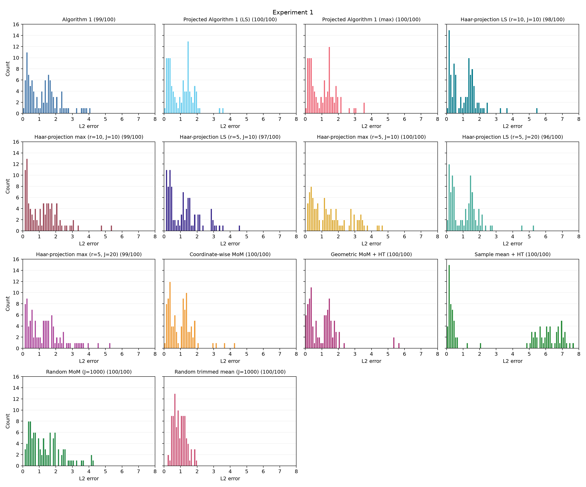
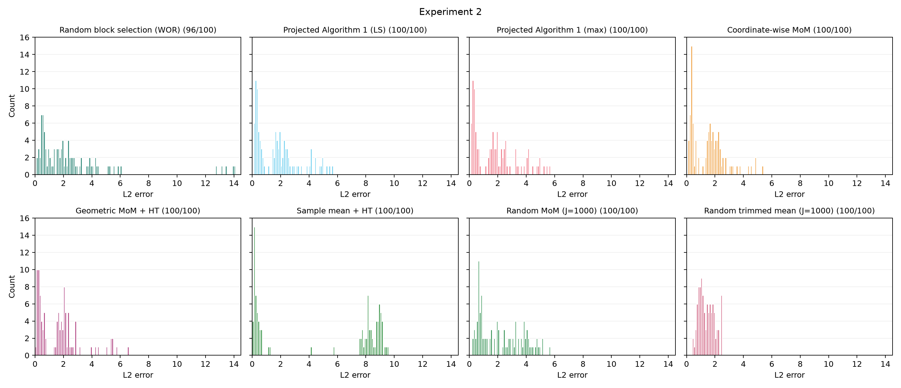
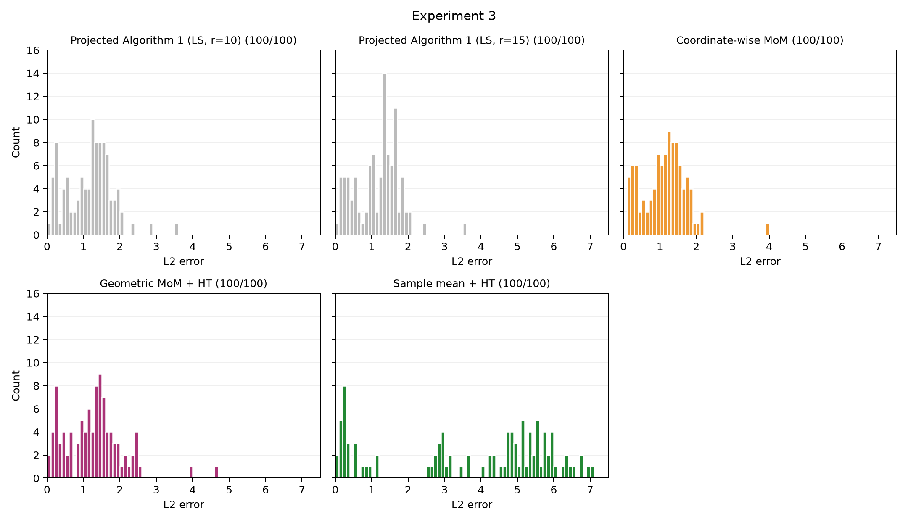
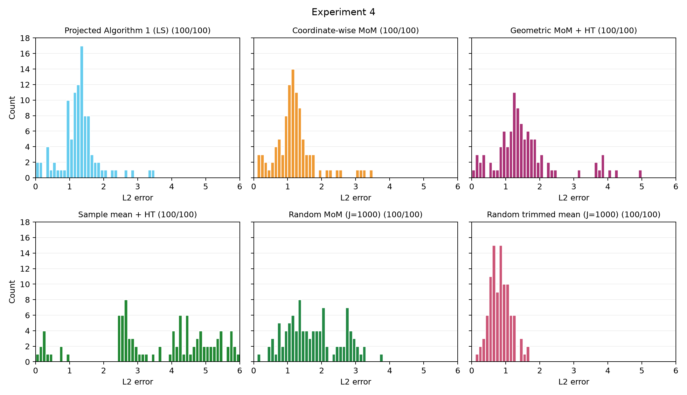
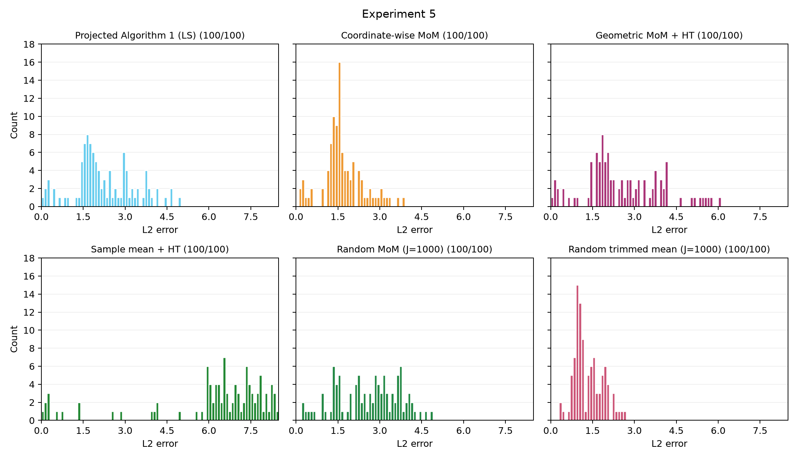
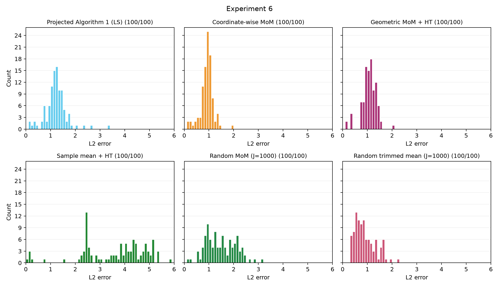
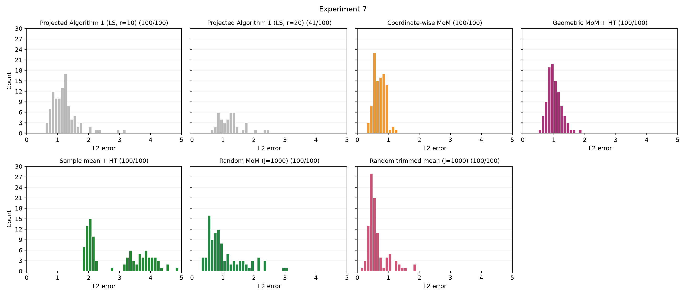
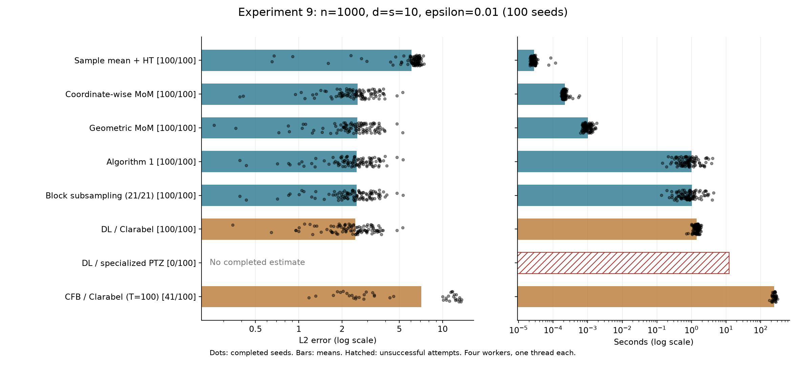
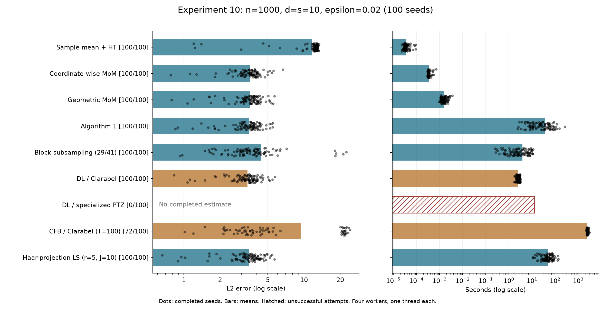
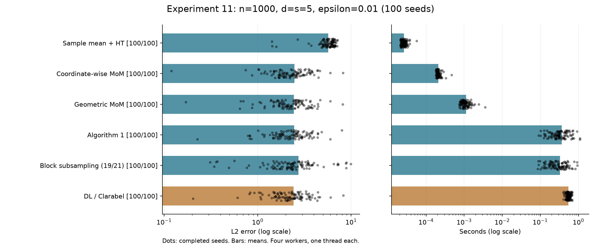

# Experiments

This file contains only experiments targeting seeds 0–99. The 10-seed pilot results are in [sanity_check/sanity_check_results.md](../../../../sanity_check/sanity_check_results.md).

Unless stated otherwise, setups use centered skew-t data with shape $S=0.5I_d+0.5\mathbf{1}\mathbf{1}^\top$, skew vector $b=10\mathbf{1}/\sqrt d$, $n=1000$, $s=5$, $\nu=2.5$, $C=2$, $\delta=0.05$, attack strength 100 and tolerance $10^{-5}$. Each seed draws an amplitude from Uniform$(1,3)$ and a random sparse support. Support recovery is the fraction of true active coordinates selected. Averages include each method's converged runs; completion counts and unfinished runs are recorded explicitly. Runtime includes estimator preprocessing and excludes shared data generation. Comparisons may use different worker counts, as noted in each section.

Previous experiment numbers 19–26 now correspond to 1–8; see [experiment_number_mapping.json](../../../experiment_number_mapping.json). Experiment 8 was removed at the user’s request; subsequent experiment numbers remain unchanged.

Sample mean + HT results were updated on 2026-10-06 using the same seeds and data: retain the s largest absolute sample mean coordinates. Both L2 error and support recovery use the thresholded estimate. Its runtimes were measured again with one warmed fit per seed, including averaging and thresholding; other method runtimes retain their original measurement conditions. Dense estimates and historical metrics are retained in detailed JSON for provenance.

## Experiments 1

Results for $(d, s, \delta, \epsilon, n) = (20, 5, 0.05, 0.01, 1000)$; $\nu=2.5$, $C=2$, $K=21$, $e_{\mathrm{tol}}=10^{-5}$:

Centered skew-t with $S=0.5I_d+0.5\mathbf{1}\mathbf{1}^\top$, $b=10\mathbf{1}/\sqrt d$, attack strength 100, $\overline\lambda=814.098772$. Random coordinate partition: $r=10$, $J=d/r=2$. Seeds 0–99; Brute-force skipped; four one-thread workers. Limits: 1 hour/seed for LS then max combined; 1 hour/seed for Algorithm 1 separately.

Haar projections: $r=10$ and $r=5$, $J=10$, dense directions $V_r$, $K=21$; same data and seeds 0–99. Limit: 1 hour/seed for Haar LS then max combined.

Additional Haar projections: $r=5$, $J=20$, dense directions $V_5$, $K=21$; same data and seeds 0–99, same 1-hour seed limit.

| Method | Mean L2 error | Mean runtime (s) | Mean support recovery | Completed seeds |
| --- | ---: | ---: | ---: | ---: |
| Algorithm 1 | 1.243943 | 52.399818 | 0.969697 | 99/100 |
| Projected Algorithm 1 (LS) | 0.999439 | 2.208462 | 0.994000 | 100/100 |
| Projected Algorithm 1 (max) | 1.049063 | 2.185594 | 0.984000 | 100/100 |
| Haar-projection LS (r=10, J=10) | 1.061293 | 41.308871 | 0.981633 | 98/100 |
| Haar-projection max (r=10, J=10) | 1.217401 | 45.151798 | 0.963636 | 99/100 |
| Haar-projection LS (r=5, J=10) | 1.168008 | 30.404181 | 0.971134 | 97/100 |
| Haar-projection max (r=5, J=10) | 1.487302 | 50.400809 | 0.928000 | 100/100 |
| Haar-projection LS (r=5, J=20) | 1.071429 | 26.672358 | 0.979167 | 96/100 |
| Haar-projection max (r=5, J=20) | 1.349558 | 48.268395 | 0.955556 | 99/100 |
| Coordinate-wise MoM | 0.997306 | 0.000162 | 0.988000 | 100/100 |
| Geometric MoM + HT | 1.055154 | 0.000734 | 0.970000 | 100/100 |
| Random MoM (tilde J=1000) | 1.374459 | 1.145171 | 0.964000 | 100/100 |
| Random trimmed mean (tilde J=1000) | 0.945187 | 1.167080 | 0.988000 | 100/100 |
| Sample mean + HT | 3.567185 | 0.000021 | 0.476000 | 100/100 |

Algorithm 1: seed 48 reached the 1,000-iteration outer cutting-plane limit after 1,699.94 s (gap 0.050845 versus tolerance 0.00001); no timeout. Its unconverged estimate and runtime are excluded from the averages and histogram. Existing methods were not rerun.

Haar-projection LS (r=10): incomplete seeds [67, 93]; averages and histogram include converged runs only.
Seed 67: 1000-iteration cutting-plane limit; gap 5.95802, tolerance 0.000263836.
Seed 93: 1000-iteration cutting-plane limit; gap 3.40213, tolerance 0.000242141.

Haar-projection max (r=10): incomplete seeds [67]; averages and histogram include converged runs only.
Seed 67: 1000-iteration cutting-plane limit; gap 0.55208, tolerance 3.55602e-05.

Averages use each method's converged seeds, so seed subsets differ.

Haar max (r=10) seed 40 was retried after adding a primal-simplex fallback for a numerical QP failure; reported runtime is the successful retry only.

Interrupted license-connection failures were resumed without rerunning completed methods; runtimes exclude unsuccessful attempts.

Haar-projection LS (r=5): incomplete seeds [48, 67, 93]; averages and histogram include converged runs only.
Seed 48: 1000-iteration cutting-plane limit; gap 0.518558, tolerance 3.17865e-05.
Seed 67: 1000-iteration cutting-plane limit; gap 3.00398, tolerance 0.000111002.
Seed 93: 1000-iteration cutting-plane limit; gap 5.55311, tolerance 0.000128922.

Haar-projection max (r=5): all 100 seeds converged.

Matched-seed comparisons (r=10 → r=5):

- LS, 97 seeds: mean L2 error 1.066919 → 1.168008; mean runtime 39.046 → 30.404 s.
- max, 99 seeds: mean L2 error 1.217401 → 1.468083; mean runtime 45.152 → 42.464 s.

Haar-projection LS (r=5, J=20): incomplete seeds [48, 67, 75, 93]; averages and histogram include converged runs only.
Seed 48: 1000-iteration cutting-plane limit; gap 0.851401, tolerance 6.91057e-05.
Seed 67: 1000-iteration cutting-plane limit; gap 10.4488, tolerance 0.000261704.
Seed 75: 1000-iteration cutting-plane limit; gap 0.239709, tolerance 0.000228363.
Seed 93: 1000-iteration cutting-plane limit; gap 8.50622, tolerance 0.000288019.

Haar-projection max (r=5, J=20): incomplete seeds [93]; averages and histogram include converged runs only.
Seed 93: 1000-iteration cutting-plane limit; gap 0.177573, tolerance 2.41932e-05.

Max QCP certification failures on seeds [41, 56, 62] were retried with a presolve-disabled fallback; objective and tolerance are unchanged, and runtimes use successful retries only.

Matched-seed comparisons for J=20 (all three configurations converged):

- LS, 96 seeds, $(r,J)=(10,10) / (5,10) / (5,20)$: mean L2 error 1.040040 / 1.149822 / 1.071429; mean runtime 37.144 / 25.584 / 26.672 s.
- max, 98 seeds, $(r,J)=(10,10) / (5,10) / (5,20)$: mean L2 error 1.201188 / 1.439001 / 1.327345; mean runtime 42.279 / 37.850 / 39.640 s.

Random MoM and random trimmed mean: both completed seeds 0–99 using the identical historical Experiment 1 samples (verified hashes and true means), with $\widetilde J=1000$ random sparse directions plus 20 coordinate directions (1020 total), direction seed equal to data seed, and tolerance $10^{-5}$. Random MoM uses $K=21$; random trimmed mean uses $k=15$ ($n-2k=970$). Objective gaps certify the finite direction bank. Each method was run once per seed, sequentially with one solver thread; runtimes include preprocessing but exclude shared data generation. Historical baseline runtimes used four concurrent workers. Per-seed estimates, metrics, bounds, settings and source hashes: [experiment1_random_j1000_results.json](../../../experiment1_random_j1000_results.json). Median runtimes: 0.134776 s (MoM) and 0.152533 s (trimmed).

Per-seed results: [experiment1_results.json](../../../experiment1_results.json).

## Experiments 2

Results for $(d, s, \delta, \epsilon, n) = (20, 5, 0.05, 0.02, 1000)$; $\nu=2.5$, $C=2$, $K=41$, $e_{\mathrm{tol}}=10^{-5}$:

Centered skew-t with $S=0.5I_d+0.5\mathbf{1}\mathbf{1}^\top$, $b=10\mathbf{1}/\sqrt d$, attack strength 100, $\overline\lambda=814.098772$. Random coordinate partition: $r=10$, $J=d/r=2$. Seeds 0–99; Algorithm 1 and brute-force skipped; four one-thread workers. Limit: 1 hour/seed for LS then max combined.

| Method | Mean L2 error | Mean runtime (s) | Mean support recovery | Completed seeds |
| --- | ---: | ---: | ---: | ---: |
| Random block selection (WOR) | 2.534882 | 253.950550 | 0.808333 | 96/100 |
| Projected Algorithm 1 (LS) | 1.726797 | 30.043136 | 0.878000 | 100/100 |
| Projected Algorithm 1 (max) | 1.784936 | 30.274020 | 0.870000 | 100/100 |
| Coordinate-wise MoM | 1.531293 | 0.000255 | 0.918000 | 100/100 |
| Geometric MoM + HT | 1.652601 | 0.000948 | 0.894000 | 100/100 |
| Random MoM (tilde J=1000) | 2.179766 | 6.996453 | 0.834000 | 100/100 |
| Random trimmed mean (tilde J=1000) | 1.404469 | 4.889970 | 0.950000 | 100/100 |
| Sample mean + HT | 4.923970 | 0.000021 | 0.436000 | 100/100 |

All five original baseline methods completed all 100 seeds.

Random MoM and random trimmed mean: both completed seeds 0–99 using the identical historical Experiment 2 samples (verified hashes and true means), with $\widetilde J=1000$ random sparse directions plus 20 coordinate directions (1020 total), direction seed equal to data seed, and tolerance $10^{-5}$. Random MoM uses $K=41$; random trimmed mean uses $k=30$ ($n-2k=940$). Objective gaps certify the finite direction bank. Each method was run once per seed, sequentially with one solver thread; runtimes include preprocessing but exclude shared data generation. Historical baseline runtimes used four concurrent workers. Per-seed estimates, metrics, bounds, settings and source hashes: [experiment2_random_j1000_results.json](../../../experiment2_random_j1000_results.json). Median runtimes: 0.455791 s (MoM) and 0.348618 s (trimmed).

<!-- experiment2-random-block-selection -->
Random block selection (WOR = without replacement): `random_block_selection` uses coefficient 2, $K_{\mathrm{sub}}=\min\{K,\operatorname{oddceil}(2[s\log(d/s)+\log(4/\delta)])\}=23$ of the original $K=41$ blocks. Each seed chooses a uniform 23-block subset without replacement using a separate `SeedSequence(seed, spawn_key=(2,))` stream; selected rows retain original block order. The subset is chosen once before Algorithm 1 optimization. Seeds 0–99 reproduce the historical data and true means exactly (all hashes verified).

These are fresh optimization runs, with four concurrent workers and one solver/BLAS thread per worker, tolerance $10^{-5}$, hybrid/indicator oracle, and outer/inner iteration limits of 1,000; no wall-time cutoff. Runtime includes block construction, selection and optimization, excluding data generation. Background Experiment 8 was stopped during measurement and resumed from checkpoints afterward.

96/100 seeds converged; unconverged or failed fits are excluded from the averages and histogram. Mean runtime is computed over converged fits; median 64.953850 s, maximum 1831.773549 s. Across all 100 attempts, including unconverged or failed attempts, mean runtime is 311.124242 s. Runtime comparisons use separate measurement batches; random-direction baselines used one sequential worker. Full Algorithm 1 was not run for Experiment 2.

A data diagnostic found that 10/100 subsets contain at least 12 contaminated blocks out of 23 (a block is counted as contaminated if it contains any replaced observation); this diagnostic does not determine solver convergence. Per-seed estimates, metrics, selected block indices, bounds, settings and source hashes: [experiment2_random_block_selection_results.json](../../../experiment2_random_block_selection_results.json). Reproduction and checkpoints: [benchmarks/experiment2_random_block_selection](../../../benchmarks/experiment2_random_block_selection).

- Seed 41: unconverged; 1000 outer iterations, gap 0.8006393, tolerance 1e-05, runtime 1641.11 s.
- Seed 48: unconverged; 1000 outer iterations, gap 0.86153868, tolerance 1e-05, runtime 1767.56 s.
- Seed 73: unconverged; 1000 outer iterations, gap 0.027845392, tolerance 1e-05, runtime 1586.67 s.
- Seed 78: unconverged; 1000 outer iterations, gap 0.12434908, tolerance 1e-05, runtime 1737.82 s.
<!-- /experiment2-random-block-selection -->

Per-seed results: [experiment2_results.json](../../../experiment2_results.json).

## Experiments 3

Results for $(d, s, \delta, \epsilon, n) = (30, 5, 0.05, 0.01, 1000)$; $\nu=2.5$, $C=2$, $K=21$, $e_{\mathrm{tol}}=10^{-5}$:

Centered skew-t with $S=0.5I_d+0.5\mathbf{1}\mathbf{1}^\top$, $b=10\mathbf{1}/\sqrt d$, attack strength 100, $\overline\lambda=864.098772$. Random coordinate partitions: $r=10$, $J=3$ and $r=15$, $J=2$. Seeds 0–99; Algorithm 1, projected max and brute-force skipped; four one-thread workers. Limit: 1 hour/seed for projected LS.

| Method | Mean L2 error | Mean runtime (s) | Mean support recovery | Completed seeds |
| --- | ---: | ---: | ---: | ---: |
| Projected Algorithm 1 (LS, r=10) | 1.174407 | 2.791410 | 0.986000 | 100/100 |
| Projected Algorithm 1 (LS, r=15) | 1.164001 | 28.871491 | 0.988000 | 100/100 |
| Coordinate-wise MoM | 1.128881 | 0.000179 | 0.988000 | 100/100 |
| Geometric MoM + HT | 1.263946 | 0.000788 | 0.976000 | 100/100 |
| Sample mean + HT | 3.710458 | 0.000022 | 0.430000 | 100/100 |

All five methods completed all 100 seeds.

Per-seed results: [experiment3_results.json](../../../experiment3_results.json).

## Experiments 4

Results for $(d, s, \delta, \epsilon, n) = (40, 5, 0.05, 0.01, 1000)$; $\nu=2.5$, $C=2$, $K=21$, $e_{\mathrm{tol}}=10^{-5}$:

Centered skew-t with $S=0.5I_d+0.5\mathbf{1}\mathbf{1}^\top$, $b=10\mathbf{1}/\sqrt d$, attack strength 100, $\overline\lambda=914.098772$. Random coordinate partition: $r=10$, $J=d/r=4$. Seeds 0–99; Algorithm 1, projected max and brute-force skipped; four one-thread workers. Limit: 1 hour/seed for projected LS.

| Method | Mean L2 error | Mean runtime (s) | Mean support recovery | Completed seeds |
| --- | ---: | ---: | ---: | ---: |
| Projected Algorithm 1 (LS) | 1.275639 | 3.510773 | 0.964000 | 100/100 |
| Coordinate-wise MoM | 1.202494 | 0.000197 | 0.960000 | 100/100 |
| Geometric MoM + HT | 1.549655 | 0.000853 | 0.902000 | 100/100 |
| Random MoM (tilde J=1000) | 1.749871 | 0.394222 | 0.914000 | 100/100 |
| Random trimmed mean (tilde J=1000) | 0.827979 | 0.130175 | 1.000000 | 100/100 |
| Sample mean + HT | 3.622134 | 0.000032 | 0.414000 | 100/100 |

All four methods completed all 100 seeds.

Random MoM and random trimmed mean: both completed seeds 0–99 using the identical historical Experiment 4 samples (verified hashes and true means), with $\widetilde J=1000$ random sparse directions plus 40 coordinate directions (1040 total), direction seed equal to data seed, and tolerance $10^{-5}$. Random MoM uses $K=21$; random trimmed mean uses $k=15$ ($n-2k=970$). Objective gaps certify the finite direction bank. Each method was run once per seed, sequentially with one solver thread; runtimes include preprocessing but exclude shared data generation. Historical baseline runtimes used four concurrent workers. Per-seed estimates, metrics, bounds, settings and source hashes: [experiment4_random_j1000_results.json](../../../experiment4_random_j1000_results.json). Median runtimes: 0.114101 s (MoM) and 0.118638 s (trimmed).

Per-seed results: [experiment4_results.json](../../../experiment4_results.json).

## Experiments 5

Results for $(d, s, \delta, \epsilon, n) = (40, 5, 0.05, 0.02, 1000)$; $\nu=2.5$, $C=2$, $K=41$, $e_{\mathrm{tol}}=10^{-5}$:

Centered skew-t with $S=0.5I_d+0.5\mathbf{1}\mathbf{1}^\top$, $b=10\mathbf{1}/\sqrt d$, attack strength 100, $\overline\lambda=914.098772$. Random coordinate partition: $r=10$, $J=d/r=4$. Seeds 0–99; Algorithm 1, projected max and brute-force skipped; four one-thread workers. Limit: 1 hour/seed for projected LS.

| Method | Mean L2 error | Mean runtime (s) | Mean support recovery | Completed seeds |
| --- | ---: | ---: | ---: | ---: |
| Projected Algorithm 1 (LS) | 2.232842 | 72.856595 | 0.748000 | 100/100 |
| Coordinate-wise MoM | 1.682787 | 0.000353 | 0.890000 | 100/100 |
| Geometric MoM + HT | 2.577158 | 0.001276 | 0.654000 | 100/100 |
| Random MoM (tilde J=1000) | 2.591692 | 1.542800 | 0.722000 | 100/100 |
| Random trimmed mean (tilde J=1000) | 1.340091 | 0.453111 | 0.958000 | 100/100 |
| Sample mean + HT | 6.167013 | 0.000034 | 0.114000 | 100/100 |

All four methods completed all 100 seeds.

Random MoM and random trimmed mean: both completed seeds 0–99 using the identical historical Experiment 5 samples (verified hashes and true means), with $\widetilde J=1000$ random sparse directions plus 40 coordinate directions (1040 total), direction seed equal to data seed, and tolerance $10^{-5}$. Random MoM uses $K=41$; random trimmed mean uses $k=30$ ($n-2k=940$). Objective gaps certify the finite direction bank. Each method was run once per seed, sequentially with one solver thread; runtimes include preprocessing but exclude shared data generation. Historical baseline runtimes used four concurrent workers. Per-seed estimates, metrics, bounds, settings and source hashes: [experiment5_random_j1000_results.json](../../../experiment5_random_j1000_results.json). Median runtimes: 0.428595 s (MoM) and 0.155313 s (trimmed).

Per-seed results: [experiment5_results.json](../../../experiment5_results.json).

## Experiments 6

Results for $(d, s, \delta, \epsilon, n) = (50, 5, 0.05, 0.01, 1000)$; $\nu=2.5$, $C=2$, $K=25$ (baselines), $K=21$ (projections), $e_{\mathrm{tol}}=10^{-5}$:

Centered skew-t with $S=0.5I_d+0.5\mathbf{1}\mathbf{1}^\top$, $b=10\mathbf{1}/\sqrt d$, attack strength 100, $\overline\lambda=964.098772$. Random coordinate partition: $r=10$, $J=d/r=5$. Seeds 0–99; Algorithm 1, projected max and brute-force skipped; four one-thread workers. Limit: 1 hour/seed for projected LS.

| Method | Mean L2 error | Mean runtime (s) | Mean support recovery | Completed seeds |
| --- | ---: | ---: | ---: | ---: |
| Projected Algorithm 1 (LS) | 1.221435 | 5.467179 | 0.970000 | 100/100 |
| Coordinate-wise MoM | 0.920005 | 0.000245 | 0.998000 | 100/100 |
| Geometric MoM + HT | 1.074571 | 0.000786 | 0.998000 | 100/100 |
| Random MoM (tilde J=1000) | 1.481336 | 0.161116 | 0.964000 | 100/100 |
| Random trimmed mean (tilde J=1000) | 0.900542 | 0.121058 | 0.998000 | 100/100 |
| Sample mean + HT | 3.585637 | 0.000036 | 0.406000 | 100/100 |

All four methods completed all 100 seeds.

Random MoM and random trimmed mean: both completed seeds 0–99 using the identical historical Experiment 6 samples (verified hashes and true means), with $\widetilde J=1000$ random sparse directions plus 50 coordinate directions (1050 total), direction seed equal to data seed, and tolerance $10^{-5}$. Random MoM uses $K=25$; random trimmed mean uses $k=15$ ($n-2k=970$). Objective gaps certify the finite direction bank. Each method was run once per seed, sequentially with one solver thread; runtimes include preprocessing but exclude shared data generation. Historical baseline runtimes used four concurrent workers. Per-seed estimates, metrics, bounds, settings and source hashes: [experiment6_random_j1000_results.json](../../../experiment6_random_j1000_results.json). Median runtimes: 0.094003 s (MoM) and 0.110511 s (trimmed).

Per-seed results: [experiment6_results.json](../../../experiment6_results.json).

## Experiments 7

Results for $(d, s, \delta, \epsilon, n) = (100, 5, 0.05, 0.01, 1000)$; $\nu=2.5$, $C=2$, $K=31$ (baselines), $K=21$ (projections), $e_{\mathrm{tol}}=10^{-5}$:

Centered skew-t with $S=0.5I_d+0.5\mathbf{1}\mathbf{1}^\top$, $b=10\mathbf{1}/\sqrt d$, attack strength 100, $\overline\lambda=1214.098772$. Random coordinate partitions: $r=10$, $J=10$ and $r=20$, $J=5$. Seeds 0–99; Algorithm 1, projected max and brute-force skipped; four one-thread workers. Limit: 1 hour/seed for projected LS.

| Method | Mean L2 error | Mean runtime (s) | Mean support recovery | Completed seeds |
| --- | ---: | ---: | ---: | ---: |
| Projected Algorithm 1 (LS, r=10) | 1.210730 | 25.511930 | 0.952000 | 100/100 |
| Projected Algorithm 1 (LS, r=20) | 1.246798 | 422.312890 | 0.956098 | 41/100 |
| Coordinate-wise MoM | 0.714421 | 0.000401 | 1.000000 | 100/100 |
| Geometric MoM + HT | 1.017777 | 0.001079 | 0.994000 | 100/100 |
| Random MoM (tilde J=1000) | 1.044994 | 0.086810 | 0.990000 | 100/100 |
| Random trimmed mean (tilde J=1000) | 0.625352 | 0.110320 | 1.000000 | 100/100 |
| Sample mean + HT | 2.928802 | 0.000046 | 0.524000 | 100/100 |

Haar-projection LS and max ($r=5$, $J=10$): **stopped by user** before all 100 seeds were processed. Partial results and per-seed statuses are preserved in the [checkpoint](../../../experiment7_haar_r5_J10_recorded_results.json); these runs have not been added to the final table or histogram.

Haar-projection LS and max ($r=5$, $J=20$): **stopped by user** before all 100 seeds were processed. Partial results and per-seed statuses are preserved in the [checkpoint](../../../experiment7_haar_recorded_results.json); these runs have not been added to the final table or histogram.

Projected LS r=20 incomplete seeds: [{'seed': 31, 'status': 'failed'}, {'seed': 32, 'status': 'failed'}, {'seed': 33, 'status': 'failed'}, {'seed': 34, 'status': 'failed'}, {'seed': 35, 'status': 'failed'}, {'seed': 36, 'status': 'failed'}, {'seed': 37, 'status': 'failed'}, {'seed': 38, 'status': 'failed'}, {'seed': 39, 'status': 'failed'}, {'seed': 40, 'status': 'failed'}, {'seed': 41, 'status': 'failed'}, {'seed': 42, 'status': 'failed'}, {'seed': 44, 'status': 'failed'}, {'seed': 45, 'status': 'failed'}, {'seed': 46, 'status': 'failed'}, {'seed': 47, 'status': 'failed'}, {'seed': 48, 'status': 'failed'}, {'seed': 49, 'status': 'failed'}, {'seed': 50, 'status': 'failed'}, {'seed': 51, 'status': 'failed'}, {'seed': 52, 'status': 'failed'}, {'seed': 53, 'status': 'failed'}, {'seed': 54, 'status': 'failed'}, {'seed': 55, 'status': 'failed'}, {'seed': 56, 'status': 'failed'}, {'seed': 57, 'status': 'failed'}, {'seed': 58, 'status': 'failed'}, {'seed': 59, 'status': 'failed'}, {'seed': 60, 'status': 'failed'}, {'seed': 61, 'status': 'failed'}, {'seed': 62, 'status': 'failed'}, {'seed': 63, 'status': 'failed'}, {'seed': 64, 'status': 'failed'}, {'seed': 65, 'status': 'failed'}, {'seed': 66, 'status': 'failed'}, {'seed': 67, 'status': 'failed'}, {'seed': 68, 'status': 'failed'}, {'seed': 78, 'status': 'failed'}, {'seed': 79, 'status': 'failed'}, {'seed': 80, 'status': 'failed'}, {'seed': 81, 'status': 'failed'}, {'seed': 82, 'status': 'failed'}, {'seed': 83, 'status': 'failed'}, {'seed': 84, 'status': 'failed'}, {'seed': 85, 'status': 'failed'}, {'seed': 86, 'status': 'failed'}, {'seed': 87, 'status': 'failed'}, {'seed': 88, 'status': 'failed'}, {'seed': 89, 'status': 'failed'}, {'seed': 90, 'status': 'failed'}, {'seed': 91, 'status': 'failed'}, {'seed': 92, 'status': 'failed'}, {'seed': 93, 'status': 'failed'}, {'seed': 94, 'status': 'failed'}, {'seed': 95, 'status': 'failed'}, {'seed': 96, 'status': 'failed'}, {'seed': 97, 'status': 'failed'}, {'seed': 98, 'status': 'failed'}, {'seed': 99, 'status': 'failed'}]. Its averages and histogram use converged returned estimates only; other methods use all 100 seeds.

Random MoM and random trimmed mean: both completed seeds 0–99 using the identical historical Experiment 7 samples (verified hashes and true means), with $\widetilde J=1000$ random sparse directions plus 100 coordinate directions (1100 total), direction seed equal to data seed, and tolerance $10^{-5}$. Random MoM uses $K=31$; random trimmed mean uses $k=15$ ($n-2k=970$). Objective gaps certify the finite direction bank. Each method was run once per seed, sequentially with one solver thread; runtimes include preprocessing but exclude shared data generation. Historical baseline runtimes used four concurrent workers. Per-seed estimates, metrics, bounds, settings and source hashes: [experiment7_random_j1000_results.json](../../../experiment7_random_j1000_results.json). Median runtimes: 0.081184 s (MoM) and 0.109385 s (trimmed).

Per-seed results: [experiment7_results.json](../../../experiment7_results.json).

<!-- experiment9-dense:start -->
## Experiments 9

Experiment 1 distribution with **n=1000, d=s=10, delta=0.05, epsilon=0.01**, seeds 0–99. Centered skew-t: nu=2.5, shape 0.5*I+0.5*11', skew vector 10*1/sqrt(d), amplitude Uniform(1,3) on all coordinates, adaptive attack strength 100 replacing ten rows. C=2, e_tol=1e-5, covariance input 2*lambda_max(Sigma)=764.098772.

The full-support complexity is d. All block methods use K=21 and the same seed partition. Block subsampling requests 29 blocks and selects all 21 without replacement, so it does not reduce the problem in this configuration. Hard thresholding is the identity at s=d.

Timing: four concurrent fresh worker processes, one BLAS/solver thread each, matching the concurrency of the historical Experiment 1 baselines. Runtime includes estimator preprocessing and excludes imports/data generation/metrics; process scheduling and contention are included. The unrelated Experiment 8 was paused during measurement and has since been removed. No wall-clock timeout is imposed. Algorithm 1 retains its existing 1000-iteration limits; CFB uses T=100 and step size 1/20. Failed/unconverged runs are excluded from successful error/runtime averages and are reported separately.

DL / Clarabel means the Depersin–Lecue covSDPofMeans outer procedure with its covering SDP solved through CVXPY/Clarabel. It is a generic-SDP implementation, not the specialized nearly-linear backend. DL/PTZ additionally uses the specialized positive-SDP updates directly, with eta=1e-4 and a 100,000-update cap per decision call. This is the small-d factorized-Taylor/identity-sketch reference kernel with dense certificates, not the full high-dimensional nearly-linear implementation. It never substitutes Clarabel on failure. Algorithm 2 remains excluded. CFB uses the SDP-based distance/gradient routines; its completion flag means the requested finite iterations completed, not an outer accuracy certificate.

| Method | Mean L2 error | Mean runtime (s) | Support recovery | Completed / original target | Unconverged / failed | Cancelled |
| --- | ---: | ---: | ---: | ---: | ---: | ---: |
| Sample mean + HT | 6.086799 | 0.000028 | 100.0% | 100/100 | 0/0 | 0 |
| Coordinate-wise MoM | 2.568332 | 0.000216 | 100.0% | 100/100 | 0/0 | 0 |
| Geometric MoM | 2.548852 | 0.001008 | 100.0% | 100/100 | 0/0 | 0 |
| Algorithm 1 | 2.519079 | 0.995678 | 100.0% | 100/100 | 0/0 | 0 |
| Block subsampling (21/21) | 2.519079 | 1.029066 | 100.0% | 100/100 | 0/0 | 0 |
| DL / Clarabel | 2.475265 | 1.401927 | 100.0% | 100/100 | 0/0 | 0 |
| DL / specialized PTZ | — | 12.325038 (unsuccessful attempts) | — | 0/100 | 100/0 | 0 |
| CFB / Clarabel (T=100) | 7.118607 | 246.605644 | 95.1% | 41/100 | 0/0 | 59 |

Batch status: **finished_with_cfb_cancelled**, 741/800 attempts recorded; 59 remaining CFB attempts cancelled. Averages use completed seeds; completion counts are shown for every method.

CFB was stopped by user request: only 41 completed seeds are retained in the averages; 59 unfinished/unstarted seeds are cancelled and will not resume. This is a partial CFB sample, while the other method attempts cover all 100 seeds. [Cancellation record](../../../experiment9_dense_comparison/cfb_cancellation.json).

Algorithm 1 and block subsampling use identical blocks. Maximum coordinate difference across 100 completed pairs: 0.

DL/PTZ: 0/100 recorded attempts completed. PTZ step formula evaluated at internal epsilon=eta/40 gives alpha=1.545e-12; internal epsilon=2.500e-06. The factor 40 is a conservative implementation choice for the decision wrapper, not a paper-prescribed constant. Unconverged attempts retain their bounds, update counts, and elapsed time in the raw records; their initial/current estimates are excluded from successful error/support averages. Unsuccessful-attempt time is not a runtime for obtaining a completed estimate.

CFB returned its zero initial iterate under the minimum-estimated-distance return rule for seeds [5, 11]. Full-support recovery is a literal nonzero-coordinate metric here, not sparse variable selection.

The literature block counts are practical choices: DL's sufficient condition K>=300*|O|=3000 exceeds n=1000, and CFB's prescribed ceil(3200*log(1/delta))=9587 also exceeds n. CFB's iid guarantee does not directly cover this adaptive contamination. These results concern the recorded implementations and settings. [DL](https://arxiv.org/abs/1906.03058), [CFB](https://proceedings.mlr.press/v99/cherapanamjeri19b.html), [PTZ](https://arxiv.org/abs/1201.5135).

[Per-seed records](../../../experiment9_dense_comparison/results.json). [Settings](../../../experiment9_dense_comparison/config.json). [Validation](../../../experiment9_dense_comparison/validation.json). [Incomplete runs](../../../experiment9_dense_comparison/incomplete_runs.json). [Source hashes](../../../experiment9_dense_comparison/source_hashes.json). [Runner](../../../experiment9_dense_comparison/run.py).

<!-- experiment9-dense:end -->

<!-- experiment10-dense:start -->
## Experiments 10

Experiment 1 distribution with **n=1000, d=s=10, delta=0.05, epsilon=0.02**, seeds 0–99. Centered skew-t: nu=2.5, shape 0.5*I+0.5*11', skew vector 10*1/sqrt(d), amplitude Uniform(1,3) on all coordinates, adaptive attack strength 100 replacing twenty rows. C=2, e_tol=1e-5, covariance input 2*lambda_max(Sigma)=764.098772.

The full-support complexity is d. All block methods construct K=41 using the same seed partition. Block subsampling selects 29 of these blocks without replacement. DL and CFB also use K=41. Compared with Experiment 9, epsilon changes from .01 to .02 and the unchanged block rule therefore changes K from 21 to 41. Clean data and truth are identical per seed across the two experiments. Hard thresholding is the identity at s=d.

Timing: four concurrent fresh worker processes, one BLAS/solver thread each, matching the concurrency of the historical Experiment 1 baselines. Runtime includes estimator preprocessing and excludes imports/data generation/metrics; process scheduling and contention are included. Experiment 8 was paused during measurement. Experiment 9 CFB was paused before this batch; the remaining CFB runs in Experiments 9 and 10 have now been cancelled by user request. The separate PTZ retry has finished; Experiment 8 has since been removed. No wall-clock timeout is imposed. Algorithm 1 retains its existing 1000-iteration limits; CFB uses T=100 and step size 1/20. Failed/unconverged runs are excluded from successful error/runtime averages and are reported separately.

DL / Clarabel means the Depersin–Lecue covSDPofMeans outer procedure with its covering SDP solved through CVXPY/Clarabel. It is a generic-SDP implementation, not the specialized nearly-linear backend. DL/PTZ additionally uses the specialized positive-SDP updates directly, with eta=1e-4 and a 100,000-update cap per decision call. This is the small-d factorized-Taylor/identity-sketch reference kernel with dense certificates, not the full high-dimensional nearly-linear implementation. It never substitutes Clarabel on failure. Algorithm 2 remains excluded. CFB uses the SDP-based distance/gradient routines; its completion flag means the requested finite iterations completed, not an outer accuracy certificate.

| Method | Mean L2 error | Mean runtime (s) | Support recovery | Completed / original target | Unconverged / failed | Cancelled |
| --- | ---: | ---: | ---: | ---: | ---: | ---: |
| Sample mean + HT | 11.681746 | 0.000037 | 100.0% | 100/100 | 0/0 | 0 |
| Coordinate-wise MoM | 3.537417 | 0.000349 | 100.0% | 100/100 | 0/0 | 0 |
| Geometric MoM | 3.546083 | 0.001593 | 100.0% | 100/100 | 0/0 | 0 |
| Algorithm 1 | 3.478282 | 37.568445 | 100.0% | 100/100 | 0/0 | 0 |
| Block subsampling (29/41) | 4.373204 | 3.823782 | 100.0% | 100/100 | 0/0 | 0 |
| DL / Clarabel | 3.383627 | 2.588790 | 100.0% | 100/100 | 0/0 | 0 |
| DL / specialized PTZ | — | 12.753385 (unsuccessful attempts) | — | 0/100 | 100/0 | 0 |
| CFB / Clarabel (T=100) | 9.351430 | 2485.804460 | 86.1% | 72/100 | 0/0 | 28 |

Batch status: **finished_with_cfb_cancelled**, 772/800 attempts recorded; 28 remaining CFB attempts cancelled. Averages use completed seeds; completion counts are shown for every method.

CFB was stopped by user request: only 72 completed seeds are retained in the averages; 28 unfinished/unstarted seeds are cancelled and will not resume. This is a partial CFB sample, while the other method attempts cover all 100 seeds. [Cancellation record](../../../experiment10_dense_eps002/cfb_cancellation.json).

Algorithm 1 uses all 41 blocks and subsampling uses 29. Maximum coordinate difference across 100 completed pairs: 6.

DL/PTZ: 0/100 recorded attempts completed. PTZ step formula evaluated at internal epsilon=eta/40 gives alpha=1.326e-12; internal epsilon=2.500e-06. The factor 40 is a conservative implementation choice for the decision wrapper, not a paper-prescribed constant. Unconverged attempts retain their bounds, update counts, and elapsed time in the raw records; their initial/current estimates are excluded from successful error/support averages. Unsuccessful-attempt time is not a runtime for obtaining a completed estimate.

CFB returned its zero initial iterate under the minimum-estimated-distance return rule for seeds [1, 11, 17, 22, 26, 49, 58, 64, 65, 71]. Full-support recovery is a literal nonzero-coordinate metric here, not sparse variable selection.

The literature block counts are practical choices: DL's sufficient condition K>=300*|O|=6000 exceeds n=1000, and CFB's prescribed ceil(3200*log(1/delta))=9587 also exceeds n. CFB's iid guarantee does not directly cover this adaptive contamination. These results concern the recorded implementations and settings. [DL](https://arxiv.org/abs/1906.03058), [CFB](https://proceedings.mlr.press/v99/cherapanamjeri19b.html), [PTZ](https://arxiv.org/abs/1201.5135).

[Per-seed records](../../../experiment10_dense_eps002/results.json). [Settings](../../../experiment10_dense_eps002/config.json). [Validation](../../../experiment10_dense_eps002/validation.json). [Incomplete runs](../../../experiment10_dense_eps002/incomplete_runs.json). [Source hashes](../../../experiment10_dense_eps002/source_hashes.json). [Runner](../../../experiment10_dense_eps002/run.py).

<!-- experiment10-dense:end -->

<!-- experiment10-ptz-eta20:start -->
### Experiment 10: DL/PTZ accuracy and iteration-limit comparison

User-requested rerun on the same 100 seeds and identical contaminated data: n=1000, d=s=10, epsilon=.02, K=41. The SDP accuracy eta=1e-4 is unchanged. Internal accuracy changes from eta/40 to eta/20; the per-decision update cap changes from 100,000 to 200,000. The acceptance certificates and all data parameters remain unchanged. Original sources and results are retained.

PTZ step alpha=5.303568017785e-12, internal accuracy=5.000000000000e-06. Four fresh workers with one solver/BLAS thread each. Remaining CFB fits were cancelled by user request; the completed CFB estimates are preserved. This PTZ rerun completed without concurrent CFB jobs. Experiment 8 has since been removed.

| PTZ configuration | Attempts / target | Completed | Unconverged / failed | Mean attempt time (s) | Mean L2 error of completed estimates |
| --- | ---: | ---: | ---: | ---: | ---: |
| eta/40; max 100,000 | 100/100 | 0 | 100/0 | 12.753385 | — |
| eta/20; max 200,000 | 100/100 | 0 | 100/0 | 27.198595 | — |

Retry status: **finished**, 100/100 attempts recorded. Attempt time includes unconverged runs and is not the runtime to obtain a completed estimate.

Seed 0 first-SDP relative gap: 26.6925506749 -> 26.6925307753 (target <=1e-4).

Mean attempt runtime ratio, new/original: 2.133.

[Retry records](../../../experiment10_dense_eps002/ptz_eta20_200k/results.json). [Settings](../../../experiment10_dense_eps002/ptz_eta20_200k/config.json). [Validation](../../../experiment10_dense_eps002/ptz_eta20_200k/validation.json). [Frozen source hashes](../../../experiment10_dense_eps002/ptz_eta20_200k/source_hashes.json). [Runner](../../../experiment10_dense_eps002/ptz_eta20_200k/run.py).
<!-- experiment10-ptz-eta20:end -->

<!-- experiment10-ptz-uncapped:start -->
### Experiment 10: uncapped DL/PTZ diagnostic (3 seeds)

Same saved Experiment 10 data for seeds 0, 1, 2: n=1000, d=s=10, epsilon=.02, K=41. SDP eta=1e-4, internal eta/20=5e-6, tol=1e-5. No SDP iteration limit and no wall-clock timeout. The theoretical PTZ iteration bound is recorded but not imposed; the covering-SDP decision-call cap is also removed in this mode. The DL outer algorithm and its own iteration/bisection rules are unchanged.

Three simultaneous fresh workers, one BLAS/solver thread each. Estimator runtime excludes imports/data loading. Experiment 8 was paused during timing and has since been removed. The user cancelled the three PTZ fits before convergence; their final recorded checkpoints are preserved. CFB remains cancelled. Prior 100-seed batches used four workers, so their wall times are not an exact matched-concurrency comparison.

| Seed | Status | Current/last decision iterations | Decision gap U/L-1 | Elapsed seconds | Completed DL/PTZ runtime (s) |
| ---: | --- | ---: | ---: | ---: | ---: |
| 0 | cancelled_by_user | 39839600 | 33.18785024 | 4632.8 | — |
| 1 | cancelled_by_user | 39648000 | 32.47943137 | 4632.9 | — |
| 2 | cancelled_by_user | 39888800 | 31.25386276 | 4632.8 | — |

Batch status: **cancelled_by_user**. Completed estimates: 0/3; unsuccessful terminal attempts: 0/3; cancelled: 3/3. Elapsed times for cancelled rows are the last recorded checkpoints, up to 10 seconds before stopping, and are not times to convergence. The decision gap is the currently running decision problem's feasible-bound gap; the enclosing SDP must meet eta=1e-4 before DL can proceed.

[Recorded checkpoints](../../../experiment10_dense_eps002/ptz_eta20_uncapped_3seeds/recorded_results.json). [Settings](../../../experiment10_dense_eps002/ptz_eta20_uncapped_3seeds/config.json). [Frozen sources](../../../experiment10_dense_eps002/ptz_eta20_uncapped_3seeds/source_hashes.json). [Runner](../../../experiment10_dense_eps002/ptz_eta20_uncapped_3seeds/run.py). [Numerical tests](../../../experiment10_dense_eps002/ptz_eta20_uncapped_3seeds/test_validation.json).
<!-- experiment10-ptz-uncapped:end -->

<!-- experiment11-dense:start -->
## Experiments 11

Experiment 9 setup with **d=s=5**; n=1000, delta=0.05, epsilon=0.01, seeds 0–99. Centered skew-t with nu=2.5, shape 0.5*I+0.5*11', skew 10*1/sqrt(d), amplitude Uniform(1,3), adaptive attack strength 100 replacing ten rows. C=2, e_tol=1e-5. The covariance input is recomputed by the same rule: 2*lambda_max(Sigma)=739.098772.

Full-support complexity is d; the unchanged block rule gives K=21 for Algorithm 1, MoM and DL. Block subsampling requests 19 blocks and selects 19/21 without replacement. Hard thresholding is the identity at s=d. Support recovery is the fraction of nonzero coordinates at threshold 1e-8, and is not informative about sparse variable selection here.

The six selected methods use exactly the frozen Experiment 9 estimator sources. Algorithm 2, CFB and DL/PTZ are excluded by user request. DL uses the original generic Clarabel covering-SDP backend and eta=1e-4. Four concurrent fresh processes, one solver/BLAS thread each; runtime includes estimator preprocessing and excludes imports/data generation/metrics. Experiments 11 and 12 run sequentially; Experiment 8 was stopped and removed. No wall-clock timeout; Algorithm 1 retains its existing 1000-iteration limits.

| Method | Mean L2 error | Mean runtime (s) | Support recovery | Completed / target | Unconverged / failed |
| --- | ---: | ---: | ---: | ---: | ---: |
| Sample mean + HT | 5.718051 | 0.000026 | 100.0% | 100/100 | 0/0 |
| Coordinate-wise MoM | 2.472797 | 0.000210 | 100.0% | 100/100 | 0/0 |
| Geometric MoM | 2.451237 | 0.001114 | 100.0% | 100/100 | 0/0 |
| Algorithm 1 | 2.458660 | 0.367468 | 100.0% | 100/100 | 0/0 |
| Block subsampling (19/21) | 2.745480 | 0.327282 | 100.0% | 100/100 | 0/0 |
| DL / Clarabel | 2.430416 | 0.549678 | 100.0% | 100/100 | 0/0 |

Batch status: **finished**, 600/600 attempts recorded. Metrics use completed estimates only; pending and failed attempts are excluded.

The DL block count is the same practical comparison choice as Experiment 9; these measurements do not establish the paper’s nearly-linear runtime guarantee.

[Per-seed records](../../../experiment11_dense_d5/results.json). [Settings](../../../experiment11_dense_d5/config.json). [Validation](../../../experiment11_dense_d5/validation.json). [Source hashes](../../../experiment11_dense_d5/source_hashes.json). [Runner](../../../experiment11_dense_d5/run.py).

<!-- experiment11-dense:end -->

<!-- experiment12-dense:start -->
## Experiments 12

Experiment 9 setup with **d=s=20**; n=1000, delta=0.05, epsilon=0.01, seeds 0–99. Centered skew-t with nu=2.5, shape 0.5*I+0.5*11', skew 10*1/sqrt(d), amplitude Uniform(1,3), adaptive attack strength 100 replacing ten rows. C=2, e_tol=1e-5. The covariance input is recomputed by the same rule: 2*lambda_max(Sigma)=814.098772.

Full-support complexity is d; the unchanged block rule gives K=41 for Algorithm 1, MoM and DL. Block subsampling requests 49 blocks and selects 41/41 without replacement. Hard thresholding is the identity at s=d. Support recovery is the fraction of nonzero coordinates at threshold 1e-8, and is not informative about sparse variable selection here.

The six selected methods use exactly the frozen Experiment 9 estimator sources. Algorithm 2, CFB and DL/PTZ are excluded by user request. DL uses the original generic Clarabel covering-SDP backend and eta=1e-4. Four concurrent fresh processes, one solver/BLAS thread each; runtime includes estimator preprocessing and excludes imports/data generation/metrics. Experiments 11 and 12 run sequentially; Experiment 8 was stopped and removed. No wall-clock timeout; Algorithm 1 retains its existing 1000-iteration limits.

| Method | Mean L2 error | Mean runtime (s) | Support recovery | Completed / target | Unconverged / failed |
| --- | ---: | ---: | ---: | ---: | ---: |
| Sample mean + HT | 6.836362 | 0.000039 | 100.0% | 100/100 | 0/0 |
| Coordinate-wise MoM | 2.244421 | 0.000409 | 100.0% | 100/100 | 0/0 |
| Geometric MoM | 2.249123 | 0.001333 | 100.0% | 100/100 | 0/0 |
| Algorithm 1 | — | — | — | 0/100 | 0/0 |
| Block subsampling (41/41) | — | — | — | 0/100 | 0/0 |
| DL / Clarabel | — | — | — | 0/100 | 0/0 |

Batch status: **running**, 300/600 attempts recorded. Metrics use completed estimates only; pending and failed attempts are excluded.

The DL block count is the same practical comparison choice as Experiment 9; these measurements do not establish the paper’s nearly-linear runtime guarantee.

[Per-seed records](../../recorded_results.json). [Settings](../../config.json). [Validation](../../validation.json). [Source hashes](../../source_hashes.json). [Runner](../../run.py).
<!-- experiment12-dense:end -->

<!-- dense-dimension-comparison:start -->
### Dense dimension comparison: Experiments 11, 9 and 12

Common settings: n=1000, epsilon=.01, delta=.05, nu=2.5, C=2, tol=1e-5; seeds 0–99. Columns show **mean L2 error / mean runtime in seconds (completed seeds)**. The d=10 column reuses Experiment 9. Block counts are 21, 21 and 41 for d=5,10,20, so dimension and K both change at d=20. This is not a fixed-K dimension-only timing test.

| Method | d=s=5, K=21 | d=s=10, K=21 | d=s=20, K=41 |
| --- | ---: | ---: | ---: |
| Sample mean + HT | 5.718051 / 0.000026 (100/100) | 6.086799 / 0.000028 (100/100) | 6.836362 / 0.000039 (100/100) |
| Coordinate-wise MoM | 2.472797 / 0.000210 (100/100) | 2.568332 / 0.000216 (100/100) | 2.244421 / 0.000409 (100/100) |
| Geometric MoM | 2.451237 / 0.001114 (100/100) | 2.548852 / 0.001008 (100/100) | 2.249123 / 0.001333 (100/100) |
| Algorithm 1 | 2.458660 / 0.367468 (100/100) | 2.519079 / 0.995678 (100/100) | Pending |
| Block subsampling (19/21, 21/21, 41/41) | 2.745480 / 0.327282 (100/100) | 2.519079 / 1.029066 (100/100) | Pending |
| DL / Clarabel | 2.430416 / 0.549678 (100/100) | 2.475265 / 1.401927 (100/100) | Pending |
<!-- dense-dimension-comparison:end -->
