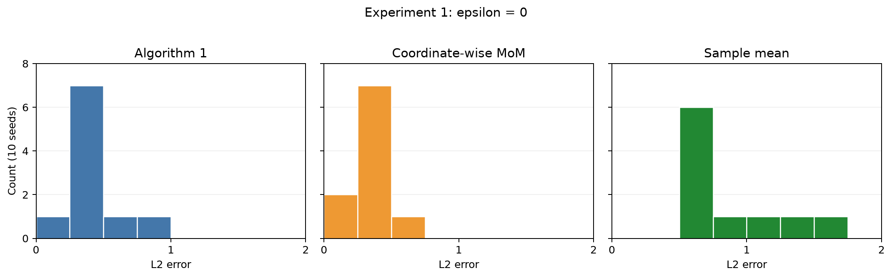
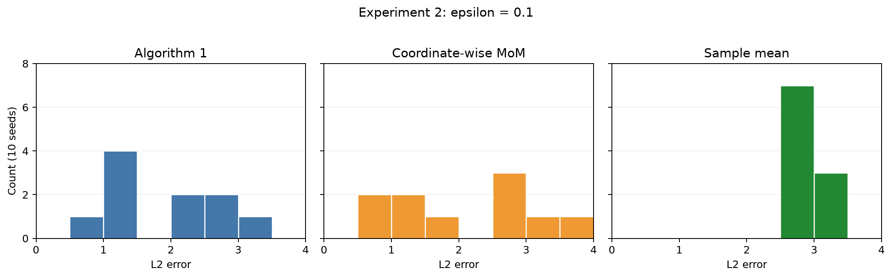
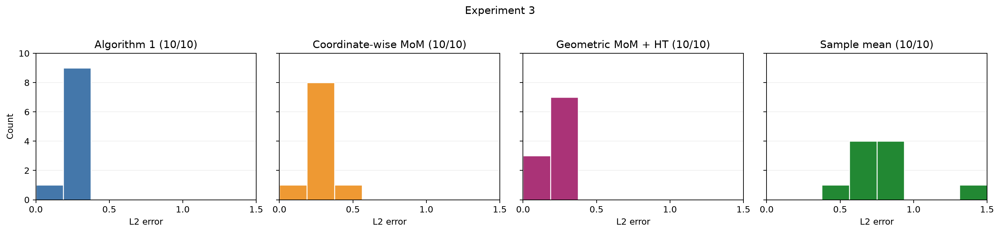
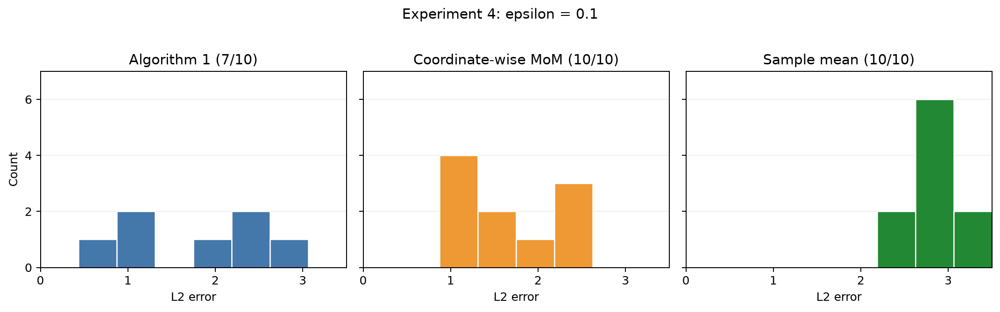
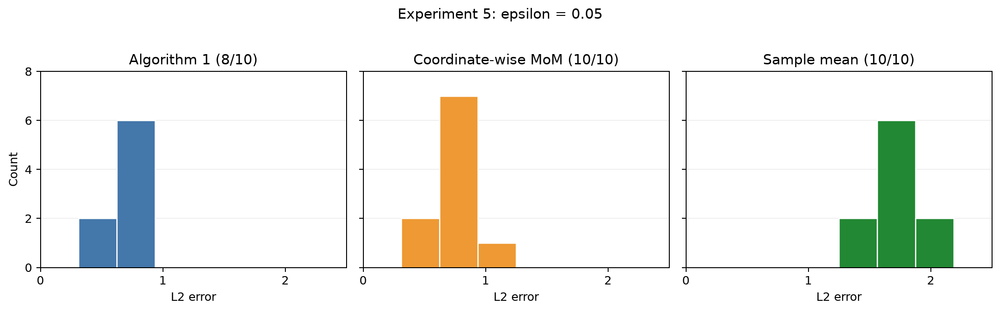

# Experiments

Experiments setup: multivariate $t_3$ with shape $I_d$ and an $s$-sparse mean. Each seed draws one amplitude from Uniform$(1,3)$ and a random support. For fixed $(n,d,s)$, seeds 0–9 use the same clean samples across contamination settings. Defaults: $C=2$, $\delta=0.05$, attack strength $30$, $\overline\lambda=6$, and $e_{\mathrm{tol}}=\sqrt{K\overline\lambda/n}/4$. Runtimes include estimator preprocessing but exclude shared data generation; up to four one-thread runs were processed concurrently. Support recovery is the fraction of true active coordinates selected; it is not defined for the dense sample mean. Within each figure, all three methods use identical bins and x/y limits; the limits may differ between experiments.

## Experiments 1

Results for $(d, s, \delta, \epsilon, n) = (20, 5, 0.05, 0, 100)$; $K=15$:

Brute-force skipped: radius-1 net 408,076,993 directions; 65.3 GB array > 16 GB RAM.

| Method | Mean L2 error | Mean runtime (s) | Mean support recovery |
| --- | ---: | ---: | ---: |
| Algorithm 1 | 0.443619 | 15.077854 | 1.000 |
| Coordinate-wise MoM | 0.366593 | 0.000254 | 1.000 |
| Sample mean | 0.892022 | 0.000007 | — |

## Experiments 2

Results for $(d, s, \delta, \epsilon, n) = (20, 5, 0.05, 0.1, 100)$; $K=21$:

Brute-force skipped: same 408,076,993-direction, 65.3 GB radius-1 net.

| Method | Mean L2 error | Mean runtime (s) | Mean support recovery |
| --- | ---: | ---: | ---: |
| Algorithm 1 | 1.865050 | 291.855069 | 0.780 |
| Coordinate-wise MoM | 2.078442 | 0.000290 | 0.700 |
| Sample mean | 2.878923 | 0.000007 | — |

## Experiments 3

Results for $(d, s, \delta, \epsilon, n) = (30, 5, 0.05, 0, 150)$; $K=19$:

Brute-force skipped: radius-1 net 41,972,797,833 directions; 10.1 TB array > 16 GB RAM.

| Method | Mean L2 error | Mean runtime (s) | Mean support recovery |
| --- | ---: | ---: | ---: |
| Algorithm 1 | 0.246961 | 49.298941 | 1.000 |
| Coordinate-wise MoM | 0.255429 | 0.000129 | 1.000 |
| Sample mean | 0.782199 | 0.000005 | — |

## Experiments 4

Results for $(d, s, \delta, \epsilon, n) = (30, 5, 0.05, 0.1, 150)$; $K=31$:

Brute-force skipped: radius-1 net 41,972,797,833 directions; 10.1 TB array > 16 GB RAM.

| Method | Mean L2 error | Mean runtime (s) | Mean support recovery |
| --- | ---: | ---: | ---: |
| Algorithm 1 (7/10 completed) | 1.740224 | 1001.043614 | 0.857 |
| Coordinate-wise MoM (10/10) | 1.686140 | 0.000163 | 0.820 |
| Sample mean (10/10) | 2.837271 | 0.000005 | — |

Algorithm 1 timed out after 30 minutes for seeds 2, 5, and 7, including solo retries. Its means use only the seven completed seeds and are not 10-seed estimates.

## Experiments 5

Results for $(d, s, \delta, \epsilon, n) = (30, 10, 0.05, 0.05, 150)$; $K=23$:

Brute-force skipped: radius-1 net 1,018,604,017,927,145 directions; 244 PB array > 16 GB RAM.

| Method | Mean L2 error | Mean runtime (s) | Mean support recovery |
| --- | ---: | ---: | ---: |
| Algorithm 1 (8/10 completed) | 0.696091 | 1024.151613 | 1.000 |
| Coordinate-wise MoM (10/10) | 0.789623 | 0.000124 | 1.000 |
| Sample mean (10/10) | 1.702656 | 0.000005 | — |

Algorithm 1 seeds 7 and 9 were stopped at the user's request after about 74 minutes and marked timeout. Its means use only the eight completed seeds and are not 10-seed estimates.

