# Sanity checks

Experiments 1–7 use a multivariate $t_\nu$ with shape $I_d$ and an $s$-sparse mean. Experiments 8–11 use a centered skew-$t_\nu$ with an $s$-sparse mean. Each seed draws one amplitude from Uniform$(1,3)$ and a random support. For fixed $(n,d,s,\nu)$, seeds 0–9 use the same clean samples across contamination settings. Experiments 1–5 set $\nu=3$, $\overline\lambda=6$, and $e_{\mathrm{tol}}=\sqrt{K\overline\lambda/n}/4$; Experiments 6–7 set $\nu=2.5$, $\overline\lambda=10$, and $e_{\mathrm{tol}}=10^{-5}$. Shared defaults: $C=2$, $\delta=0.05$, attack strength $30$. Geometric MoM + HT takes the Euclidean geometric median of the same $K$ block means and retains its $s$ largest-magnitude coordinates ([Minsker and Strawn](https://arxiv.org/abs/2307.03111)). Runtimes include estimator preprocessing but exclude shared data generation; up to four one-thread runs were processed concurrently. Support recovery is the fraction of true active coordinates selected; Sample mean + HT retains the s largest absolute sample mean coordinates. Within each figure, all plotted methods use identical bins and x/y limits; the limits may differ between experiments.

These are pilot runs over seeds 0–9. Original experiment numbers are retained for provenance. The 100-seed experiments are listed in [../results.md](../results.md).

Sample mean + HT results were updated on 2026-10-06 using the same seeds and data: retain the s largest absolute sample mean coordinates. Both L2 error and support recovery use the thresholded estimate. Its runtimes were measured again with one warmed fit per seed, including averaging and thresholding; other method runtimes retain their original measurement conditions. Dense estimates and historical metrics are retained in detailed JSON for provenance.

## Sanity check 1 (original Experiment 1)

Results for $(d, s, \delta, \epsilon, n) = (20, 5, 0.05, 0, 100)$; $K=15$:

Brute-force skipped: radius-1 net 408,076,993 directions; 65.3 GB array > 16 GB RAM.

| Method | Mean L2 error | Mean runtime (s) | Mean support recovery |
| --- | ---: | ---: | ---: |
| Algorithm 1 | 0.443619 | 15.077854 | 1.000 |
| Projected Algorithm 1 (LS) | 0.329578 | 1.305803 | 1.000 |
| Projected Algorithm 1 (max) | 0.323841 | 1.066333 | 1.000 |
| Coordinate-wise MoM | 0.366593 | 0.000254 | 1.000 |
| Geometric MoM + HT | 0.287253 | 0.000779 | 1.000 |
| Random MoM (tilde J=10) | 0.439761 | 0.026397 | 1.000 |
| Random trimmed mean (tilde J=10) | 0.349879 | 0.025899 | 1.000 |
| Random MoM (tilde J=20) | 0.462883 | 0.052925 | 1.000 |
| Random trimmed mean (tilde J=20) | 0.357993 | 0.026268 | 1.000 |
| Random MoM (tilde J=50) | 0.627385 | 0.026494 | 1.000 |
| Random trimmed mean (tilde J=50) | 0.408631 | 0.025924 | 1.000 |
| Random MoM (tilde J=100) | 0.612289 | 0.028904 | 1.000 |
| Random trimmed mean (tilde J=100) | 0.422202 | 0.026316 | 1.000 |
| Random MoM (tilde J=1000) | 0.457077 | 0.076217 | 1.000 |
| Random trimmed mean (tilde J=1000) | 0.360803 | 0.064885 | 1.000 |
| Sample mean + HT | 0.416150 | 0.000008 | 1.000000 |

Projected methods: $J=10$, $r=10$, projected $K=7$; support cutting-plane aggregation with absolute/relative tolerances $10^{-5}$ and same-support LS refinement for max. Both completed seeds 0–9 with full coordinate coverage; four concurrent one-thread runs. Existing baseline rows retain their recorded results. Per-seed errors and metrics: `experiment1_errors.json`, `experiment1_projected_results.json`.

Random MoM and random trimmed mean: both completed seeds 0–9 with $\widetilde J=10$ random sparse directions plus 20 coordinate directions (30 total), and $e_{\mathrm{tol}}=10^{-5}$. Both use the same direction seed as the data seed, hence the same direction bank per seed; historical sample hashes and truths were verified. Random MoM uses $K=15$ and random trimmed mean uses $k=4$ ($n-2k=92$). These gaps certify the finite direction bank objective. Runs were sequential with one solver thread; runtimes include estimator preprocessing but exclude data generation. The historical Algorithm 1 tolerance is approximately 0.237171, so its tolerance and timing conditions differ. Per-seed estimates, bounds, metrics, settings, and source hashes: [experiment1_random_j10_results.json](../artifacts/sanity_check/experiment1_random_j10_results.json).

Random MoM and random trimmed mean: both completed seeds 0–9 with $\widetilde J=20$ random sparse directions plus 20 coordinate directions (40 total), and $e_{\mathrm{tol}}=10^{-5}$. Both use the same direction seed as the data seed, hence the same direction bank per seed; historical sample hashes and truths were verified. Random MoM uses $K=15$ and random trimmed mean uses $k=4$ ($n-2k=92$). These gaps certify the finite direction bank objective. Runs were sequential with one solver thread; runtimes include estimator preprocessing but exclude data generation. The historical Algorithm 1 tolerance is approximately 0.237171, so its tolerance and timing conditions differ. Per-seed estimates, bounds, metrics, settings, and source hashes: [experiment1_random_j20_results.json](../artifacts/sanity_check/experiment1_random_j20_results.json). The J=20 single-pass MoM mean includes a 0.281 s first-run outlier. A warmed alternating J=10/20 benchmark (five repeats per seed, 50 fits per method and J) gives MoM means 0.024661 vs 0.025081 s (+1.7%), and trimmed means 0.025000 vs 0.025296 s (+1.2%). Medians remain about 0.026 s; these small differences do not establish a scaling trend. Measurements: [experiment1_random_j10_j20_timing.json](../artifacts/sanity_check/experiment1_random_j10_j20_timing.json).

Random MoM and random trimmed mean: both completed seeds 0–9 with $\widetilde J=50$ random sparse directions plus 20 coordinate directions (70 total), and $e_{\mathrm{tol}}=10^{-5}$. Both use the same direction seed as the data seed, hence the same direction bank per seed; historical sample hashes and truths were verified. Random MoM uses $K=15$ and random trimmed mean uses $k=4$ ($n-2k=92$). These gaps certify the finite direction bank objective. Runs were sequential with one solver thread; runtimes include estimator preprocessing but exclude data generation. The historical Algorithm 1 tolerance is approximately 0.237171, so its tolerance and timing conditions differ. Per-seed estimates, bounds, metrics, settings, and source hashes: [experiment1_random_j50_results.json](../artifacts/sanity_check/experiment1_random_j50_results.json). A warmed benchmark rotates J=10/20/50 order with five repeats per seed (50 fits per method and J). MoM mean runtimes for J=10/20/50 are 0.024633/0.024125/0.026534 s; trimmed mean runtimes are 0.025342/0.024968/0.025729 s. J=50 versus J=10 changes the means by +7.7% (MoM) and +1.5% (trimmed). These small timing differences do not establish a scaling trend. Measurements: [experiment1_random_j10_j20_j50_timing.json](../artifacts/sanity_check/experiment1_random_j10_j20_j50_timing.json).

Random MoM and random trimmed mean: both completed seeds 0–9 with $\widetilde J=100$ random sparse directions plus 20 coordinate directions (120 total), and $e_{\mathrm{tol}}=10^{-5}$. Both use the same direction seed as the data seed, hence the same direction bank per seed; historical sample hashes and truths were verified. Random MoM uses $K=15$ and random trimmed mean uses $k=4$ ($n-2k=92$). These gaps certify the finite direction bank objective. Runs were sequential with one solver thread; runtimes include estimator preprocessing but exclude data generation. The historical Algorithm 1 tolerance is approximately 0.237171, so its tolerance and timing conditions differ. Per-seed estimates, bounds, metrics, settings, and source hashes: [experiment1_random_j100_results.json](../artifacts/sanity_check/experiment1_random_j100_results.json). A warmed benchmark rotates J=10/20/50/100 order with five repeats per seed (50 fits per method and J). MoM mean runtimes for J=10/20/50/100 are 0.025436/0.025478/0.025996/0.029750 s; trimmed mean runtimes are 0.025638/0.025407/0.025755/0.025687 s. J=100 versus J=10 changes the means by +17.0% (MoM) and +0.2% (trimmed). Measurements: [experiment1_random_j10_j20_j50_j100_timing.json](../artifacts/sanity_check/experiment1_random_j10_j20_j50_j100_timing.json).

Random MoM and random trimmed mean: both completed seeds 0–9 with $\widetilde J=10000$ random sparse directions plus 20 coordinate directions (1020 total), and $e_{\mathrm{tol}}=10^{-5}$. Both use the same direction seed as the data seed, hence the same direction bank per seed; historical sample hashes and truths were verified. Random MoM uses $K=15$ and random trimmed mean uses $k=4$ ($n-2k=92$). These gaps certify the finite direction bank objective. Runs were sequential with one solver thread; runtimes include estimator preprocessing but exclude data generation. The historical Algorithm 1 tolerance is approximately 0.237171, so its tolerance and timing conditions differ. Per-seed estimates, bounds, metrics, settings, and source hashes: [experiment1_random_j1000_results.json](../artifacts/sanity_check/experiment1_random_j1000_results.json). A warmed benchmark rotates J=10/100/1000 order with five repeats per seed (50 fits per method and J). MoM mean runtimes for J=10/100/1000 are 0.031607/0.037054/0.068891 s; trimmed mean runtimes are 0.029333/0.037969/0.063605 s. J=1000 versus J=10 runtime ratios are 2.18 (MoM) and 2.17 (trimmed). Measurements: [experiment1_random_j10_j100_j1000_timing.json](../artifacts/sanity_check/experiment1_random_j10_j100_j1000_timing.json).

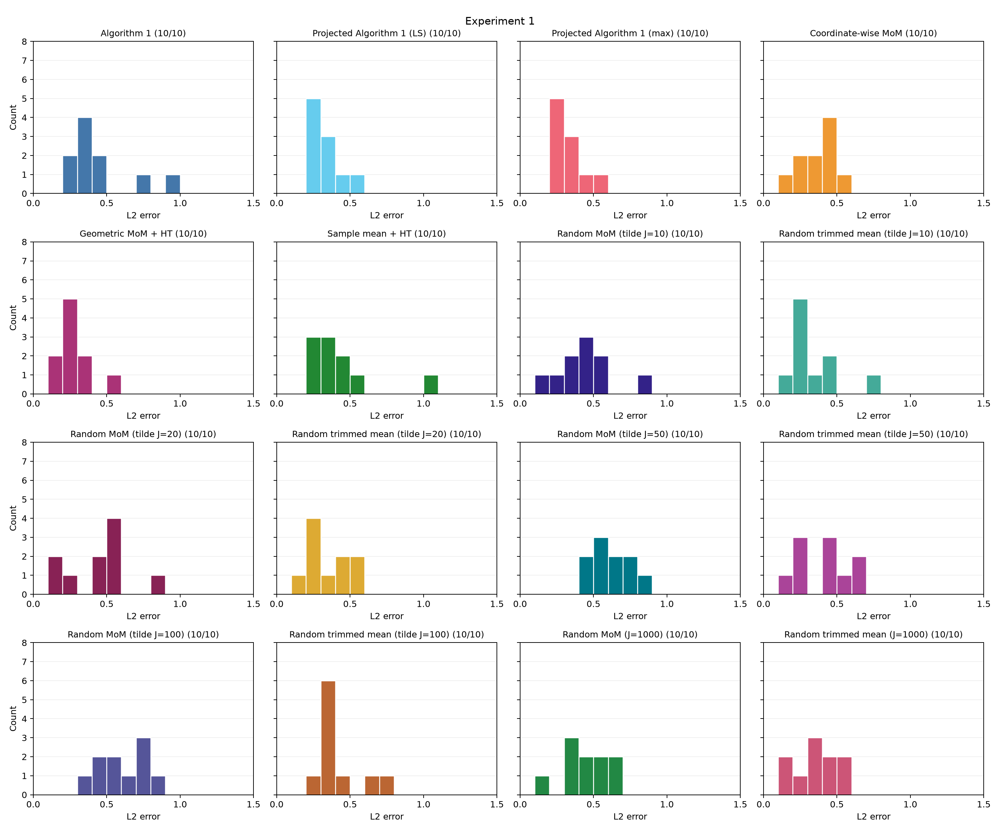

Reconstructed sample mean + HT seed results: [experiment1_sample_mean_ht_results.json](../artifacts/sanity_check/experiment1_sample_mean_ht_results.json). The dense sample mean average was checked against the historical table.

## Sanity check 2 (original Experiment 2)

Results for $(d, s, \delta, \epsilon, n) = (20, 5, 0.05, 0.1, 100)$; $K=21$:

Brute-force skipped: same 408,076,993-direction, 65.3 GB radius-1 net.

| Method | Mean L2 error | Mean runtime (s) | Mean support recovery |
| --- | ---: | ---: | ---: |
| Algorithm 1 | 1.865050 | 291.855069 | 0.780 |
| Coordinate-wise MoM | 2.078442 | 0.000290 | 0.700 |
| Geometric MoM + HT | 1.675652 | 0.000983 | 0.780 |
| Sample mean + HT | 2.496147 | 0.000008 | 0.680000 |

The updated figure shows Sample mean + HT only: historical seed-level errors for the other methods are unavailable; their table results are retained.

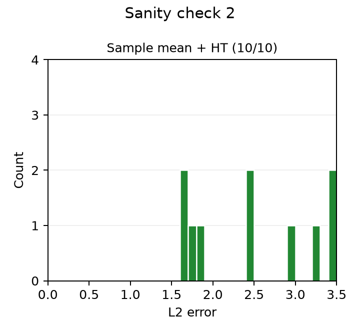

Reconstructed sample mean + HT seed results: [experiment2_sample_mean_ht_results.json](../artifacts/sanity_check/experiment2_sample_mean_ht_results.json). The dense sample mean average was checked against the historical table.

## Sanity check 3 (original Experiment 3)

Results for $(d, s, \delta, \epsilon, n) = (30, 5, 0.05, 0, 150)$; $K=19$:

Brute-force skipped: radius-1 net 41,972,797,833 directions; 10.1 TB array > 16 GB RAM.

| Method | Mean L2 error | Mean runtime (s) | Mean support recovery |
| --- | ---: | ---: | ---: |
| Algorithm 1 | 0.246961 | 47.287453 | 1.000 |
| Projected Algorithm 1 (LS) | 0.523946 | 1.121061 | 0.980 |
| Projected Algorithm 1 (max) | 0.525952 | 1.039686 | 0.980 |
| Coordinate-wise MoM | 0.255429 | 0.000201 | 1.000 |
| Geometric MoM + HT | 0.216059 | 0.000498 | 1.000 |
| Sample mean + HT | 0.275339 | 0.000009 | 1.000000 |

Projected methods: $J=10$, $r=10$, projected $K=7$; support cutting-plane aggregation with absolute/relative tolerances $10^{-5}$ and same-support LS refinement for max. All six methods completed seeds 0–9; four concurrent one-thread runs. Uncovered true support coordinates (zero-based): seed 4: [2]. Per-seed errors and metrics: `experiment3_errors.json`, `experiment3_results.json`.

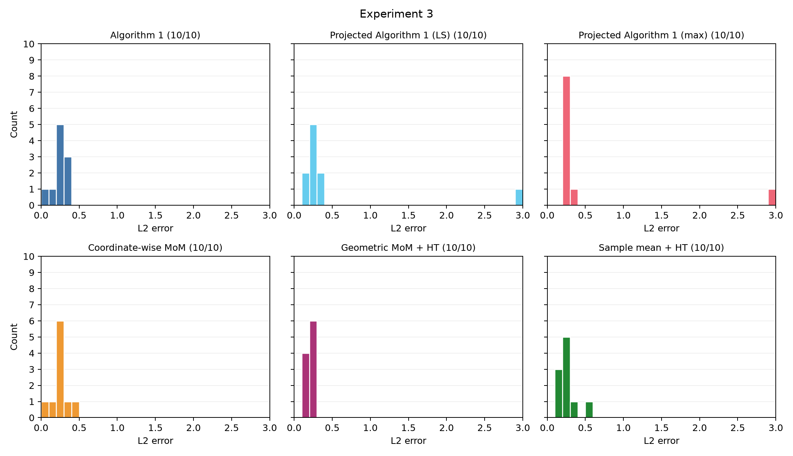

## Sanity check 4 (original Experiment 4)

Results for $(d, s, \delta, \epsilon, n) = (30, 5, 0.05, 0.1, 150)$; $K=31$:

Brute-force skipped: radius-1 net 41,972,797,833 directions; 10.1 TB array > 16 GB RAM.

| Method | Mean L2 error | Mean runtime (s) | Mean support recovery |
| --- | ---: | ---: | ---: |
| Algorithm 1 (7/10 completed) | 1.740224 | 1001.043614 | 0.857 |
| Coordinate-wise MoM (10/10) | 1.686140 | 0.000163 | 0.820 |
| Geometric MoM + HT (10/10) | 1.740425 | 0.000778 | 0.800 |
| Sample mean + HT (10/10) | 2.355711 | 0.000009 | 0.700000 |

Algorithm 1 timed out after 30 minutes for seeds 2, 5, and 7, including solo retries. Its means use only the seven completed seeds and are not 10-seed estimates.

The updated figure shows Sample mean + HT only: historical seed-level errors for the other methods are unavailable; their table results are retained.

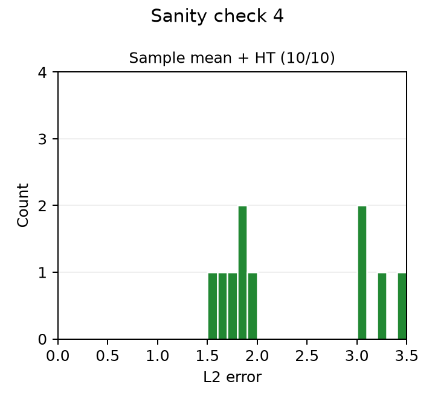

Reconstructed sample mean + HT seed results: [experiment4_sample_mean_ht_results.json](../artifacts/sanity_check/experiment4_sample_mean_ht_results.json). The dense sample mean average was checked against the historical table.

## Sanity check 5 (original Experiment 5)

Results for $(d, s, \delta, \epsilon, n) = (30, 10, 0.05, 0.05, 150)$; $K=23$:

Brute-force skipped: radius-1 net 1,018,604,017,927,145 directions; 244 PB array > 16 GB RAM.

| Method | Mean L2 error | Mean runtime (s) | Mean support recovery |
| --- | ---: | ---: | ---: |
| Algorithm 1 (8/10 completed) | 0.696091 | 1024.151613 | 1.000 |
| Coordinate-wise MoM (10/10) | 0.789623 | 0.000124 | 1.000 |
| Geometric MoM + HT (10/10) | 0.689913 | 0.000661 | 1.000 |
| Sample mean + HT (10/10) | 1.143972 | 0.000010 | 0.980000 |

Algorithm 1 seeds 7 and 9 were stopped at the user's request after about 74 minutes and marked timeout. Its means use only the eight completed seeds and are not 10-seed estimates.

The updated figure shows Sample mean + HT only: historical seed-level errors for the other methods are unavailable; their table results are retained.

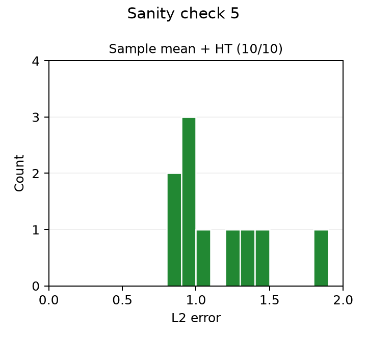

Reconstructed sample mean + HT seed results: [experiment5_sample_mean_ht_results.json](../artifacts/sanity_check/experiment5_sample_mean_ht_results.json). The dense sample mean average was checked against the historical table.

## Sanity check 6 (original Experiment 6)

Results for $(d, s, \delta, \epsilon, n) = (20, 3, 0.05, 0.02, 1000)$; $\nu=2.5$, $K=41$, $\overline\lambda=10$, $e_{\mathrm{tol}}=10^{-5}$:

Brute-force skipped: radius-1 net 3,093,169 directions > 200,000-point cap.

| Method | Mean L2 error | Mean runtime (s) | Mean support recovery |
| --- | ---: | ---: | ---: |
| Algorithm 1 | 0.362205 | 237.292572 | 1.000 |
| Coordinate-wise MoM | 0.341607 | 0.000201 | 1.000 |
| Geometric MoM + HT | 0.369129 | 0.000451 | 1.000 |
| Sample mean + HT | 0.449012 | 0.000024 | 1.000000 |

The updated figure shows Sample mean + HT only: historical seed-level errors for the other methods are unavailable; their table results are retained.

Reconstructed sample mean + HT seed results: [experiment6_sample_mean_ht_results.json](../artifacts/sanity_check/experiment6_sample_mean_ht_results.json). The dense sample mean average was checked against the historical table.

## Sanity check 7 (original Experiment 7)

Results for $(d, s, \delta, \epsilon, n) = (20, 5, 0.05, 0.02, 1000)$; $\nu=2.5$, $K=41$, $\overline\lambda=10$, $e_{\mathrm{tol}}=10^{-5}$:

Brute-force skipped: radius-1 net 408,076,993 directions; 65.3 GB array > 16 GB RAM.

| Method | Mean L2 error | Mean runtime (s) | Mean support recovery |
| --- | ---: | ---: | ---: |
| Algorithm 1 | 0.482036 | 1957.417511 | 1.000 |
| Coordinate-wise MoM | 0.386067 | 0.000267 | 1.000 |
| Geometric MoM + HT | 0.370027 | 0.000592 | 1.000 |
| Sample mean + HT | 0.448963 | 0.000019 | 1.000000 |

The updated figure shows Sample mean + HT only: historical seed-level errors for the other methods are unavailable; their table results are retained.

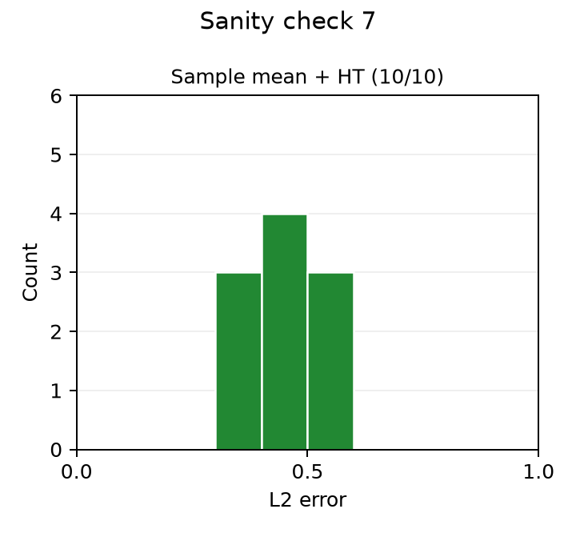

Reconstructed sample mean + HT seed results: [experiment7_sample_mean_ht_results.json](../artifacts/sanity_check/experiment7_sample_mean_ht_results.json). The dense sample mean average was checked against the historical table.

## Sanity check 8 (original Experiment 8)

Results for $(d, s, \delta, \epsilon, n) = (10, 3, 0.05, 0.01, 1000)$; $\nu=2.5$, $K=21$, $\overline\lambda=764.098772$, $e_{\mathrm{tol}}=10^{-5}$:

Skew-$t_\nu$ with shape $S=0.5I_d+0.5\mathbf{1}\mathbf{1}^\top$ and skew vector $b=10\mathbf{1}/\sqrt d$. Seeds 0–9; the radius-1 net has 29,305 directions. All methods completed all 10 seeds.

| Method | Mean L2 error | Mean runtime (s) | Mean support recovery |
| --- | ---: | ---: | ---: |
| Algorithm 1 | 0.500894 | 3.032932 | 1.000 |
| Brute-force | 0.496876 | 0.738198 | 1.000 |
| Projected Algorithm 1 (LS) | 0.401590 | 5.964727 | 1.000 |
| Projected Algorithm 1 (max) | 0.410981 | 6.110855 | 1.000 |
| Coordinate-wise MoM | 0.437631 | 0.000166 | 1.000 |
| Geometric MoM + HT | 0.377550 | 0.003708 | 1.000 |
| Random MoM (tilde J=1000) | 0.488809 | 0.057097 | 1.000 |
| Random trimmed mean (tilde J=1000) | 0.741115 | 0.106122 | 1.000 |
| Sample mean + HT | 0.436692 | 0.000018 | 1.000000 |

Projected methods: $J=10$, $r=5$, projected $K=21$; $e_{\mathrm{tol}}=10^{-5}$ for Algorithm 1 and every dense projection. Aggregation uses support cutting planes with absolute/relative tolerances $10^{-5}$ and same-support LS refinement for max. All seven methods completed seeds 0–9; four concurrent one-thread runs. All coordinates were covered in every seed. Per-seed errors and metrics: `experiment8_errors.json`, `experiment8_results.json`.

Random MoM and random trimmed mean: both completed seeds 0–9 using the identical historical Experiment 8 samples (verified hashes and true means), with $\widetilde J=1000$ random sparse directions plus 10 coordinate directions (1010 total), direction seed equal to data seed, and tolerance $10^{-5}$. Random MoM uses $K=21$; random trimmed mean uses $k=15$ ($n-2k=970$). Objective gaps certify the finite direction bank. Each method was run once per seed, sequentially with one solver thread; runtimes include preprocessing but exclude shared data generation. Historical baseline runtimes used four concurrent workers. Per-seed estimates, metrics, bounds, settings and source hashes: [experiment8_random_j1000_results.json](../artifacts/sanity_check/experiment8_random_j1000_results.json).

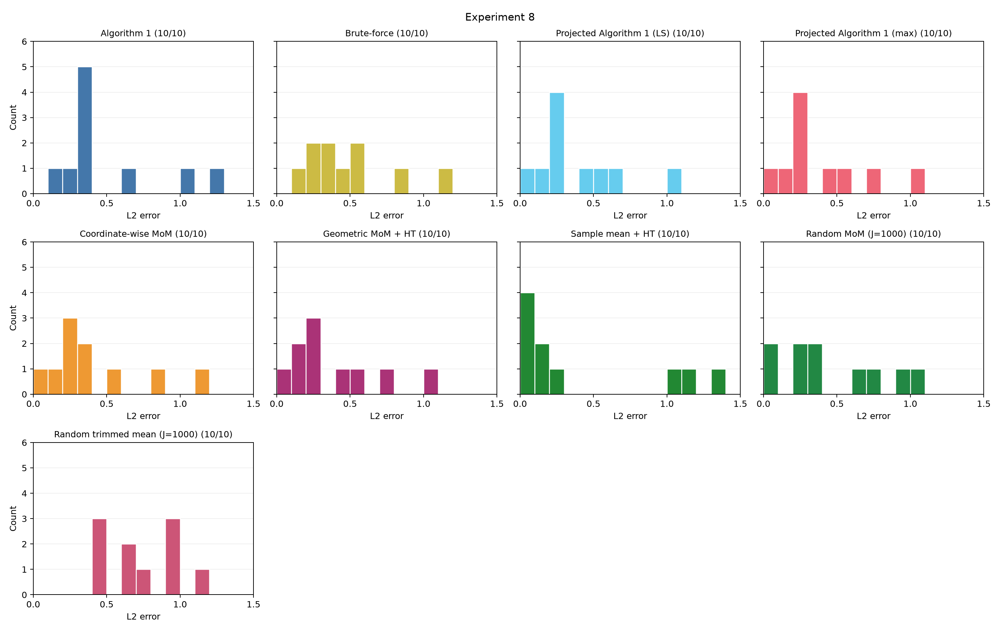

## Sanity check 9 (original Experiment 9)

Results for $(d, s, \delta, \epsilon, n) = (10, 3, 0.05, 0.02, 1000)$; $\nu=2.5$, $K=41$, $\overline\lambda=764.098772$, $e_{\mathrm{tol}}=10^{-5}$:

Skew-$t_\nu$ with shape $S=0.5I_d+0.5\mathbf{1}\mathbf{1}^\top$ and skew vector $b=10\mathbf{1}/\sqrt d$. Seeds 0–9; the radius-1 net has 29,305 directions. All methods completed all 10 seeds.

| Method | Mean L2 error | Mean runtime (s) | Mean support recovery |
| --- | ---: | ---: | ---: |
| Algorithm 1 | 0.814742 | 51.383820 | 1.000 |
| Brute-force | 0.775652 | 0.811421 | 1.000 |
| Coordinate-wise MoM | 0.753275 | 0.000212 | 1.000 |
| Geometric MoM + HT | 0.666036 | 0.000769 | 1.000 |
| Sample mean + HT | 1.390311 | 0.000018 | 0.833333 |

The updated figure shows Sample mean + HT only: historical seed-level errors for the other methods are unavailable; their table results are retained.

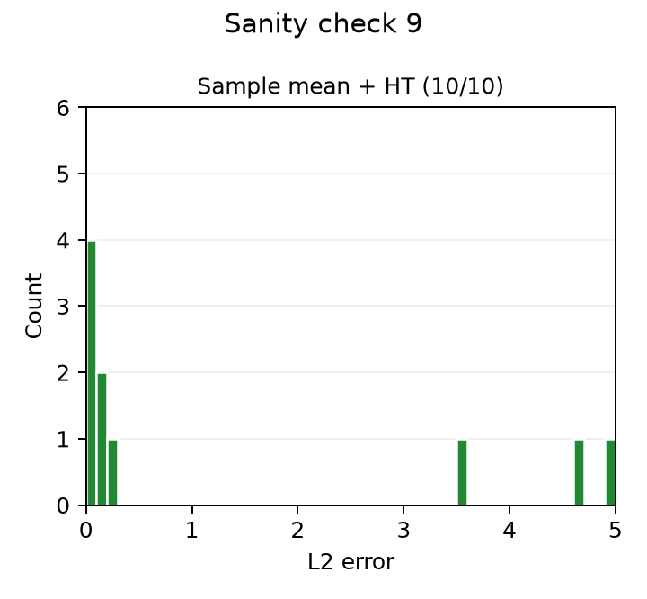

Reconstructed sample mean + HT seed results: [experiment9_sample_mean_ht_results.json](../artifacts/sanity_check/experiment9_sample_mean_ht_results.json). The dense sample mean average was checked against the historical table.

## Sanity check 10 (original Experiment 10)

Results for $(d, s, \delta, \epsilon, n) = (20, 5, 0.05, 0.05, 1000)$; $\nu=2.5$, $K=101$, $\overline\lambda=814.098772$, $e_{\mathrm{tol}}=10^{-5}$:

Skew-$t_\nu$ with shape $S=0.5I_d+0.5\mathbf{1}\mathbf{1}^\top$ and skew vector $b=10\mathbf{1}/\sqrt d$. Seeds 0–9 completed for the three fast methods.

Brute-force skipped: the radius-1 net has 408,076,993 directions and would require 65.3 GB for its raw float64 matrix.

| Method | Mean L2 error | Mean runtime (s) | Mean support recovery |
| --- | ---: | ---: | ---: |
| Algorithm 1 (0/10 completed) | — | — | — |
| Coordinate-wise MoM | 3.058356 | 0.000287 | 0.620 |
| Geometric MoM + HT | 3.179425 | 0.000850 | 0.600 |
| Sample mean + HT | 4.584389 | 0.000018 | 0.440000 |

Algorithm 1 seeds 0–3 each ran for over two hours without returning an estimator and were stopped as timeouts. Seeds 4–9 were not attempted after these four timeouts; no Algorithm 1 mean is available.

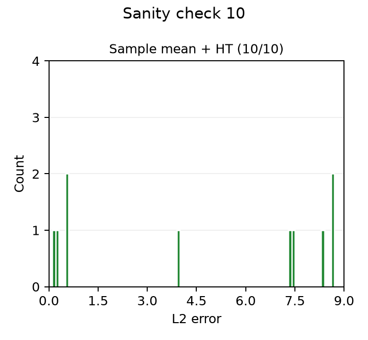

Reconstructed sample mean + HT seed results: [experiment10_sample_mean_ht_results.json](../artifacts/sanity_check/experiment10_sample_mean_ht_results.json). The dense sample mean average was checked against the historical table.

## Sanity check 11 (original Experiment 11)

Results for $(d, s, \delta, \epsilon, n) = (10, 4, 0.05, 0.03, 1000)$; $\nu=2.5$, $K=61$, $\overline\lambda=764.098772$, $e_{\mathrm{tol}}=10^{-5}$:

Skew-$t_\nu$ with shape $S=0.5I_d+0.5\mathbf{1}\mathbf{1}^\top$ and skew vector $b=10\mathbf{1}/\sqrt d$. Seeds 0–9; the radius-1 net has 110,125 directions.

| Method | Mean L2 error | Mean runtime (s) | Mean support recovery |
| --- | ---: | ---: | ---: |
| Algorithm 1 (9/10 completed) | 1.443974 | 1031.438921 | 1.000 |
| Brute-force | 1.837067 | 16.560599 | 0.900 |
| Coordinate-wise MoM | 1.584275 | 0.000257 | 0.950 |
| Geometric MoM + HT | 1.190783 | 0.000884 | 1.000 |
| Sample mean + HT | 2.876452 | 0.000019 | 0.700000 |

Algorithm 1 means use completed seeds 0, 1, 2, 3, 4, 5, 6, 7, 9 only; seeds 8 are still running. The Algorithm 1 means are not comparable 10-seed estimates.

The updated figure shows Sample mean + HT only: historical seed-level errors for the other methods are unavailable; their table results are retained.

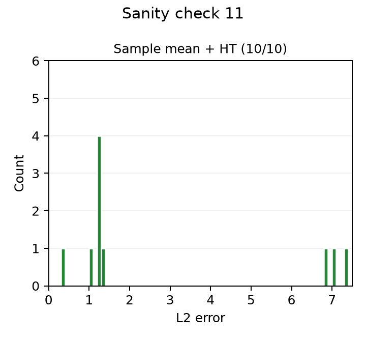

Reconstructed sample mean + HT seed results: [experiment11_sample_mean_ht_results.json](../artifacts/sanity_check/experiment11_sample_mean_ht_results.json). The dense sample mean average was checked against the historical table.

## Sanity check 12 (original Experiment 12)

Results for $(d, s, \delta, \epsilon, n) = (10, 3, 0.05, 0.01, 1000)$; $\nu=2.5$, $K=21$, $\overline\lambda=764.098772$, $e_{\mathrm{tol}}=10^{-5}$:

Skew-$t_\nu$ with $S=0.5I_d+0.5\mathbf{1}\mathbf{1}^\top$ and $b=10\mathbf{1}/\sqrt d$; attack strength 100, $r=5$, $J=d/r=2$. Seeds 0–9; all seven methods completed.

| Method | Mean L2 error | Mean runtime (s) | Mean support recovery |
| --- | ---: | ---: | ---: |
| Algorithm 1 | 0.597770 | 8.016217 | 1.000 |
| Brute-force | 0.606569 | 1.392120 | 1.000 |
| Projected Algorithm 1 (LS) | 0.537169 | 2.720179 | 1.000 |
| Projected Algorithm 1 (max) | 0.537169 | 2.696994 | 1.000 |
| Coordinate-wise MoM | 0.508337 | 0.000367 | 1.000 |
| Geometric MoM + HT | 0.470341 | 0.001664 | 1.000 |
| Sample mean + HT | 1.860822 | 0.000018 | 0.700000 |

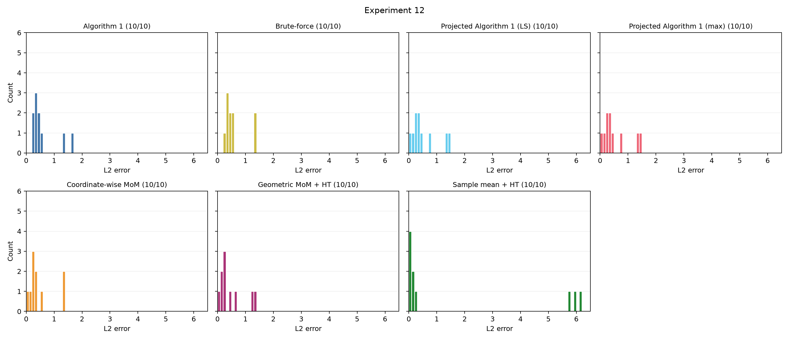

## Sanity check 13 (original Experiment 13)

Results for $(d, s, \delta, \epsilon, n) = (20, 5, 0.05, 0, 100)$; $\nu=3$, $C=2$, $e_{\mathrm{tol}}=10^{-5}$:

Experiment 1 speed comparison, seeds 0–9: the archived implementation before acceleration versus the current hybrid implementation, using identical data and tolerances. Projected methods use the same current coordinate partition, $r=10$, $J=d/r=2$. Four concurrent workers; one solver thread per worker; execution order alternated by seed. All runs converged.

| Method | Before mean runtime (s) | After mean runtime (s) | Speedup | Faster seeds |
| --- | ---: | ---: | ---: | ---: |
| Algorithm 1 | 62.508230 | 10.462445 | 5.97× | 10/10 |
| Projected LS | 0.289558 | 0.236186 | 1.23× | 8/10 |
| Projected max | 0.279559 | 0.237639 | 1.18× | 8/10 |

| Method | Before mean L2 error | After mean L2 error | Before / after mean support recovery |
| --- | ---: | ---: | ---: |
| Algorithm 1 | 0.430643 | 0.434042 | 1.000 / 1.000 |
| Projected LS | 0.338212 | 0.338214 | 1.000 / 1.000 |
| Projected max | 0.338212 | 0.338214 | 1.000 / 1.000 |

Algorithm 1 exact separation calls fell from 231.1 to 28.4 per seed on average. Its objective certificate intervals agree within 7.3e-9 across implementations; the returned estimates can differ despite matching objective values. The speed gain is substantial for Algorithm 1 and modest for the already fast projected methods. These are paired comparisons across seeds, with one timing measurement per version and seed.

Per-seed estimates, timings, certificates, settings and source hashes: [experiment1_speed_comparison.json](../artifacts/sanity_check/experiment1_speed_comparison.json). Both versions use the current tolerance and projection partition, so the historical Experiment 1 timing table is not the baseline for this comparison.

## Sanity check 14 (original Experiment 14)

Results for $(d, s, \delta, \epsilon, n) = (10, 3, 0.05, 0.01, 1000)$; $\nu=2.5$, $C=2$, $e_{\mathrm{tol}}=10^{-5}$:

Experiment 8 speed comparison, seeds 0–9: centered skew-t with $S=0.5I_d+0.5\mathbf{1}\mathbf{1}^\top$, $b=10\mathbf{1}/\sqrt d$, attack strength 100, $\overline\lambda=764.098772$. Both implementations use identical data, tolerances and the current coordinate partition ($r=5$, $J=d/r=2$). Four concurrent workers; one solver thread per worker; execution order alternated by seed. All runs converged.

| Method | Before mean runtime (s) | After mean runtime (s) | Speedup | Faster seeds |
| --- | ---: | ---: | ---: | ---: |
| Algorithm 1 | 4.066053 | 0.864941 | 4.70× | 10/10 |
| Projected LS | 1.258986 | 0.858614 | 1.47× | 8/10 |
| Projected max | 1.254451 | 0.874593 | 1.43× | 8/10 |

| Method | Before mean L2 error | After mean L2 error | Before / after mean support recovery |
| --- | ---: | ---: | ---: |
| Algorithm 1 | 0.597770 | 0.646946 | 1.000 / 1.000 |
| Projected LS | 0.537169 | 0.537167 | 1.000 / 1.000 |
| Projected max | 0.537169 | 0.537167 | 1.000 / 1.000 |

Algorithm 1 exact separation calls fell from 45.3 to 5.4 per seed on average. Its objective certificate intervals agree within 6.4e-9 across implementations, while its mean L2 error increased by 8.2%. Matching objective values do not imply matching estimates or L2 errors; this is consistent with nonunique optima. Projected errors are essentially unchanged. Timing results use one measurement per version and seed.

Per-seed estimates, timings, certificates, settings and source hashes: [experiment8_speed_comparison.json](../artifacts/sanity_check/experiment8_speed_comparison.json). The baseline is the archived implementation before acceleration, rerun under the same settings; the historical Experiment 8 uses different projection and attack settings.

## Sanity check 15 (original Experiment 15)

Results for $(d, s, \delta, \epsilon, n) = (20, 5, 0.05, 0.05, 1000)$; $\nu=2.5$, $C=2$, $K=101$, $e_{\mathrm{tol}}=10^{-5}$:

Centered skew-t with $S=0.5I_d+0.5\mathbf{1}\mathbf{1}^\top$, $b=10\mathbf{1}/\sqrt d$, attack strength 100, $\overline\lambda=814.098772$. Random coordinate partition: $r=5$, $J=d/r=4$. Seeds 0–9; Algorithm 1 and brute-force skipped; four one-thread workers. Limit: 1 hour/seed for LS then max combined.

| Method | Mean L2 error | Mean runtime (s) | Mean support recovery | Completed seeds |
| --- | ---: | ---: | ---: | ---: |
| Projected Algorithm 1 (LS) | 5.188187 | 381.698262 | 0.285714 | 7/10 |
| Projected Algorithm 1 (max) | 5.181456 | 384.561399 | 0.285714 | 7/10 |
| Coordinate-wise MoM | 3.467775 | 0.000508 | 0.540000 | 10/10 |
| Geometric MoM + HT | 3.905997 | 0.001449 | 0.460000 | 10/10 |
| Sample mean + HT | 9.725116 | 0.000026 | 0.360000 | 10/10 |

Timeout seeds: [1, 5, 7]; failed seeds: []. Means and histograms use returned estimators only; completion counts differ, so these are not matched 10-seed comparisons.

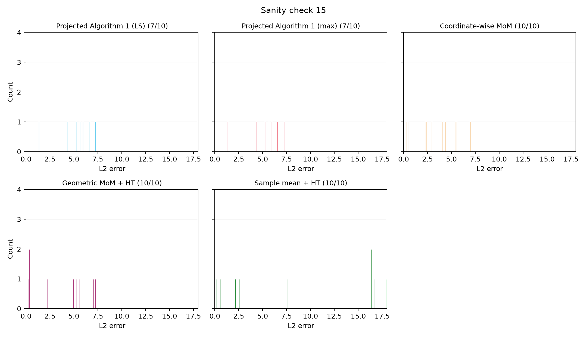

Per-seed results: [experiment15_results.json](../artifacts/sanity_check/experiment15_results.json).

## Sanity check 16 (original Experiment 16)

Results for $(d, s, \delta, \epsilon, n) = (20, 5, 0.05, 0.01, 1000)$; $\nu=2.5$, $C=2$, $K=21$, $e_{\mathrm{tol}}=10^{-5}$:

Centered skew-t with $S=0.5I_d+0.5\mathbf{1}\mathbf{1}^\top$, $b=10\mathbf{1}/\sqrt d$, attack strength 100, $\overline\lambda=814.098772$. Random coordinate partition: $r=10$, $J=d/r=2$. Seeds 0–9; Algorithm 1 and brute-force skipped; four one-thread workers. Limit: 1 hour/seed for LS then max combined.

| Method | Mean L2 error | Mean runtime (s) | Mean support recovery | Completed seeds |
| --- | ---: | ---: | ---: | ---: |
| Projected Algorithm 1 (LS) | 0.922114 | 1.949102 | 1.000000 | 10/10 |
| Projected Algorithm 1 (max) | 0.922114 | 1.776757 | 1.000000 | 10/10 |
| Coordinate-wise MoM | 0.894656 | 0.000153 | 1.000000 | 10/10 |
| Geometric MoM + HT | 0.936265 | 0.000690 | 1.000000 | 10/10 |
| Sample mean + HT | 3.368490 | 0.000024 | 0.560000 | 10/10 |

All five methods completed all ten seeds.

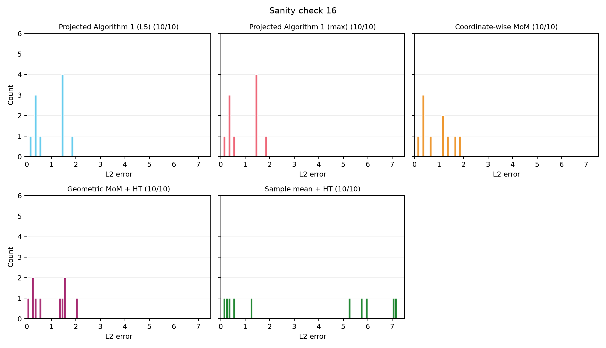

Per-seed results: [experiment16_results.json](../artifacts/sanity_check/experiment16_results.json).

## Sanity check 17 (original Experiment 17)

Results for $(d, s, \delta, \epsilon, n) = (20, 5, 0.05, 0.02, 1000)$; $\nu=2.5$, $C=2$, $K=41$, $e_{\mathrm{tol}}=10^{-5}$:

Centered skew-t with $S=0.5I_d+0.5\mathbf{1}\mathbf{1}^\top$, $b=10\mathbf{1}/\sqrt d$, attack strength 100, $\overline\lambda=814.098772$. Random coordinate partition: $r=10$, $J=d/r=2$. Seeds 0–9; Algorithm 1 and brute-force skipped; four one-thread workers. Limit: 1 hour/seed for LS then max combined.

| Method | Mean L2 error | Mean runtime (s) | Mean support recovery | Completed seeds |
| --- | ---: | ---: | ---: | ---: |
| Projected Algorithm 1 (LS) | 1.537994 | 29.858429 | 0.900000 | 10/10 |
| Projected Algorithm 1 (max) | 1.539662 | 29.313480 | 0.900000 | 10/10 |
| Coordinate-wise MoM | 1.506711 | 0.000218 | 0.920000 | 10/10 |
| Geometric MoM + HT | 1.562103 | 0.000929 | 0.900000 | 10/10 |
| Sample mean + HT | 4.943137 | 0.000019 | 0.440000 | 10/10 |

All five methods completed all ten seeds.

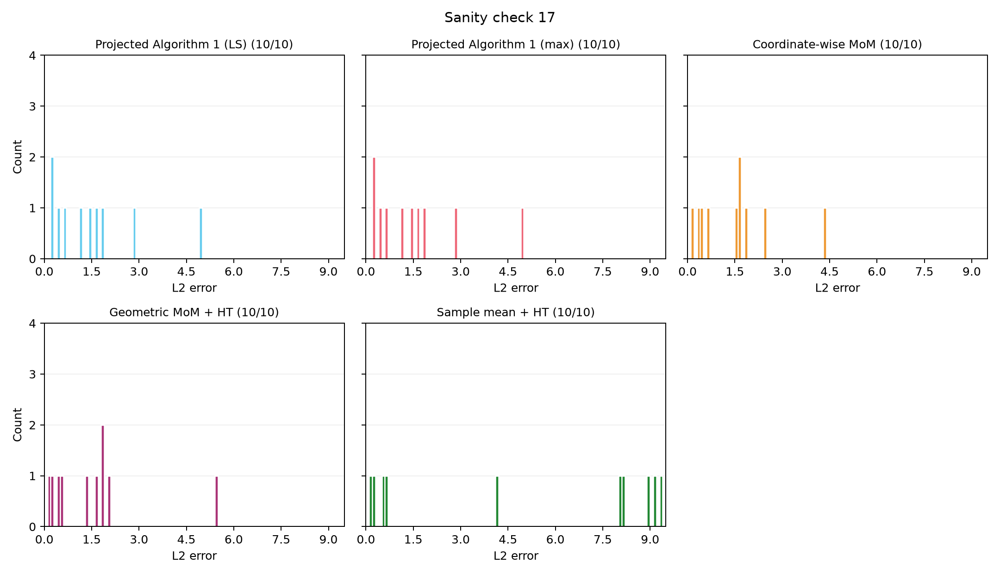

Per-seed results: [experiment17_results.json](../artifacts/sanity_check/experiment17_results.json).

## Sanity check 18 (original Experiment 18)

Results for $(d, s, \delta, \epsilon, n) = (20, 5, 0.05, 0.03, 1000)$; $\nu=2.5$, $C=2$, $K=61$, $e_{\mathrm{tol}}=10^{-5}$:

Centered skew-t with $S=0.5I_d+0.5\mathbf{1}\mathbf{1}^\top$, $b=10\mathbf{1}/\sqrt d$, attack strength 100, $\overline\lambda=814.098772$. Random coordinate partition: $r=10$, $J=d/r=2$. Seeds 0–9; Algorithm 1 and brute-force skipped; four one-thread workers. Limit: 1 hour/seed for LS then max combined.

| Method | Mean L2 error | Mean runtime (s) | Mean support recovery | Completed seeds |
| --- | ---: | ---: | ---: | ---: |
| Projected Algorithm 1 (LS) | 2.003594 | 204.756288 | 0.860000 | 10/10 |
| Projected Algorithm 1 (max) | 2.298642 | 182.431536 | 0.820000 | 10/10 |
| Coordinate-wise MoM | 1.969372 | 0.000322 | 0.840000 | 10/10 |
| Geometric MoM + HT | 2.256754 | 0.001254 | 0.800000 | 10/10 |
| Sample mean + HT | 6.441664 | 0.000020 | 0.420000 | 10/10 |

All five methods completed all ten seeds.

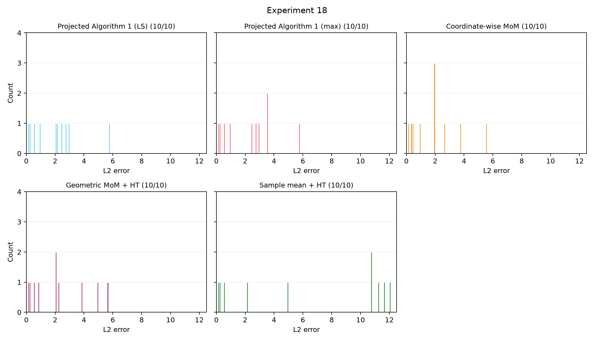

Per-seed results: [experiment18_results.json](../artifacts/sanity_check/experiment18_results.json).
<!-- algorithm1-runtime-scaling:start -->
## Sanity check 19: Algorithm 1 runtime versus dimension

Both comparisons fix $s=2$, $\delta=0.05$, $\epsilon=0.1$. Additional settings: multivariate $t_3$ data with shape $I_d$, sparse signal amplitude Uniform$(1,3)$ per seed, $\overline\lambda=6$, attack strength 30, $C=2$, and fixed tolerance $10^{-5}$. Algorithm 1 uses the current hybrid indicator oracle and additional heuristics, with its default outer/inner iteration limits of 1000. Seeds 0–9; one fit per setting and seed, run sequentially with one solver thread and BLAS thread. Other experiment workers were stopped during timing; unfinished fits restarted from saved checkpoints afterwards. Runtime includes estimator initialization and optimization, excluding data generation and metric calculation. The shared $(n,d)=(100,10)$ fits are reused in both comparisons (50 unique fits total). Data share the distribution and seed convention; samples across differing dimensions or sample sizes are not nested.

| n | d | K | Mean runtime (s) | Median runtime (s) | Min–max runtime (s) | Completed seeds |
| ---: | ---: | ---: | ---: | ---: | ---: | ---: |
| 100 | 5 | 21 | 0.584063 | 0.430051 | 0.198885–1.830713 | 10/10 |
| 100 | 10 | 21 | 1.353482 | 1.283784 | 0.308443–2.873593 | 10/10 |
| 100 | 20 | 21 | 5.004604 | 3.462382 | 0.775656–13.759740 | 10/10 |

Dimension 5 → 20 (4×) changes mean runtime by 8.569×. The block count stays at $K=21$.

<!-- random-block-dimension:start -->

**Comparison of full Algorithm 1 and random-block variants.** Every method uses identical data and true means for each seed (verified SHA256 and vector equality). Full Algorithm 1 and with-replacement coefficients 2/3 reuse the earlier results. The new method resets the coefficient to 2 and samples **without replacement**, using
$K_{\mathrm{sub}}=\min(K,\operatorname{oddceil}(2[s\log(d/s)+\log(4/\delta)]))$.
Original K-block construction is unchanged. K and the requested count are odd, so the capped count is odd. The subset is uniform; every selected block is used once. A separate RNG stream from `block_selection_seed=seed` generates a uniform permutation; its prefix selects the subset and original block order is restored for optimization. If all K blocks are selected, optimization matches full Algorithm 1. Historical with-replacement methods retain duplicate draws and do not cap K_sub. Each coefficient 3 draw list extends the corresponding coefficient 2 list, but there is no prefix relationship across sampling modes.

All variants use tolerance $10^{-5}$ and the existing Algorithm 1 heuristics. One fit per setting and seed 0–9, with no best-of-repeat selection. Statistics below use converged seed quadruplets. Timings include original block construction, selection, and optimization; they come from separate batches, each sequential with one solver/BLAS thread and other experiment workers stopped.

| d | Method | Blocks used / draws | Mean runtime (s) | Mean L2 error | Mean support recovery | Matched seeds |
| ---: | --- | ---: | ---: | ---: | ---: | ---: |
| 5 | Full Algorithm 1 | 21 | 0.584063 | 1.573191 | 0.550000 | 10/10 |
| 5 | With replacement (c=2) | 13 | 0.178120 | 2.771857 | 0.400000 | 10/10 |
| 5 | With replacement (c=3) | 19 | 0.227369 | 2.385375 | 0.550000 | 10/10 |
| 5 | Without replacement (c=2) | 13 | 0.230080 | 1.552535 | 0.700000 | 10/10 |
| 10 | Full Algorithm 1 | 21 | 1.353482 | 1.552860 | 0.600000 | 10/10 |
| 10 | With replacement (c=2) | 17 | 0.528845 | 1.751657 | 0.550000 | 10/10 |
| 10 | With replacement (c=3) | 23 | 1.667612 | 1.600732 | 0.600000 | 10/10 |
| 10 | Without replacement (c=2) | 17 | 0.646315 | 1.708677 | 0.550000 | 10/10 |
| 20 | Full Algorithm 1 | 21 | 5.004604 | 1.312090 | 0.750000 | 10/10 |
| 20 | With replacement (c=2) | 19 | 2.345579 | 2.467131 | 0.450000 | 10/10 |
| 20 | With replacement (c=3) | 27 | 5.914372 | 2.540293 | 0.350000 | 10/10 |
| 20 | Without replacement (c=2) | 19 | 4.219576 | 1.483466 | 0.700000 | 10/10 |

At d=5,10,20, without-replacement coefficient 2 selects exactly 13,17,19 distinct blocks from K=21. The cap is not active in these five benchmark setups; the K_sub > K edge case is covered by solver tests.
<!-- random-block-dimension:end -->

## Sanity check 20: Algorithm 1 runtime versus sample size

| n | d | K | Mean runtime (s) | Median runtime (s) | Min–max runtime (s) | Completed seeds |
| ---: | ---: | ---: | ---: | ---: | ---: | ---: |
| 100 | 10 | 21 | 1.353482 | 1.283784 | 0.308443–2.873593 | 10/10 |
| 200 | 10 | 41 | 16.802956 | 8.471418 | 1.734780–42.521479 | 10/10 |
| 300 | 10 | 61 | 47.132910 | 24.707848 | 3.510498–149.464890 | 10/10 |

Sample size 100 → 300 (3×) changes mean runtime by 34.823×. The default block rule gives $K=21,41,61$: $K$ is the smallest odd integer at least $2\max\{s\log(d/s),\epsilon n,\log(1/\delta)\}$. Here $\epsilon n$ dominates, so the n sweep also increases the integer oracle's block count rather than only data preprocessing.

For equal 2× input changes, mean runtime ratios are 3.698× for d:10 → 20 and 12.415× for n:100 → 200. Across the same seeds, the geometric mean ratio of these runtime multipliers is 0.450 (paired-seed bootstrap 95% interval 0.176–1.131); values above 1 favor a larger dimension effect. The observed average multiplier is larger for sample size (and its induced block count) in this setup. The interval spans 1, so these ten seeds do not clearly distinguish the two effects. This is a runtime comparison over these settings and seeds, not evidence of an asymptotic complexity law; seed difficulty and solve iteration counts can strongly affect the timings.

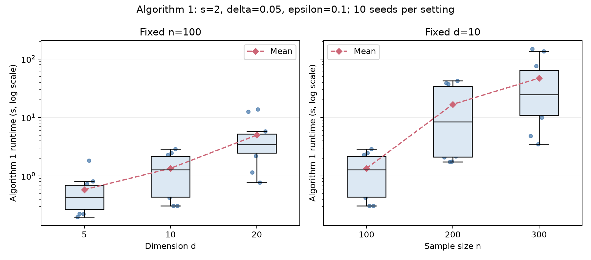

[Detailed settings, seed-level metrics, solver diagnostics, and comparisons](../artifacts/sanity_check/algorithm1_runtime_scaling/results.json).
<!-- random-block-sample-size:start -->

**Comparison at fixed d=10.** The full method uses K=21,41,61. Coefficient 2 uses K_sub=17 for both sampling modes; without replacement these are always 17 distinct blocks. With-replacement coefficient 3 uses 23 draws.

| n | Method | Blocks used / draws | Mean runtime (s) | Mean L2 error | Mean support recovery | Matched seeds |
| ---: | --- | ---: | ---: | ---: | ---: | ---: |
| 100 | Full Algorithm 1 | 21 | 1.353482 | 1.552860 | 0.600000 | 10/10 |
| 100 | With replacement (c=2) | 17 | 0.528845 | 1.751657 | 0.550000 | 10/10 |
| 100 | With replacement (c=3) | 23 | 1.667612 | 1.600732 | 0.600000 | 10/10 |
| 100 | Without replacement (c=2) | 17 | 0.646315 | 1.708677 | 0.550000 | 10/10 |
| 200 | Full Algorithm 1 | 41 | 16.802956 | 1.061677 | 0.750000 | 10/10 |
| 200 | With replacement (c=2) | 17 | 0.949909 | 1.523484 | 0.650000 | 10/10 |
| 200 | With replacement (c=3) | 23 | 2.778302 | 1.470612 | 0.650000 | 10/10 |
| 200 | Without replacement (c=2) | 17 | 1.046804 | 1.704689 | 0.650000 | 10/10 |
| 300 | Full Algorithm 1 | 61 | 47.132910 | 1.089228 | 0.750000 | 10/10 |
| 300 | With replacement (c=2) | 17 | 0.540871 | 1.377336 | 0.650000 | 10/10 |
| 300 | With replacement (c=3) | 23 | 2.204543 | 1.581843 | 0.650000 | 10/10 |
| 300 | Without replacement (c=2) | 17 | 1.044637 | 2.277339 | 0.450000 | 10/10 |

Effect of replacing coefficient-2 sampling with replacement (WR2) by sampling without replacement (WOR2):

| n | d | WR2 / WOR2 mean runtime | L2 error change (WOR2 − WR2) | Support change (percentage points) | Full / WOR2 mean runtime |
| ---: | ---: | ---: | ---: | ---: | ---: |
| 100 | 5 | 0.77× | -1.219322 | +30.0 | 2.54× |
| 100 | 10 | 0.82× | -0.042980 | +0.0 | 2.09× |
| 100 | 20 | 0.56× | -0.983665 | +25.0 | 1.19× |
| 200 | 10 | 0.91× | +0.181205 | +0.0 | 16.05× |
| 300 | 10 | 0.52× | +0.900003 | -20.0 | 45.12× |

Against WR2, WOR2 has lower mean L2 error in 3/5 settings. Mean support recovery improves in 2, worsens in 1, and is unchanged in 2. It has lower mean runtime than full Algorithm 1 in 5/5 settings. This remains a ten-seed pilot with one block selection per seed; timing ratios compare separate batches and do not establish an asymptotic complexity law. Objective gaps concern each selected-block collection.

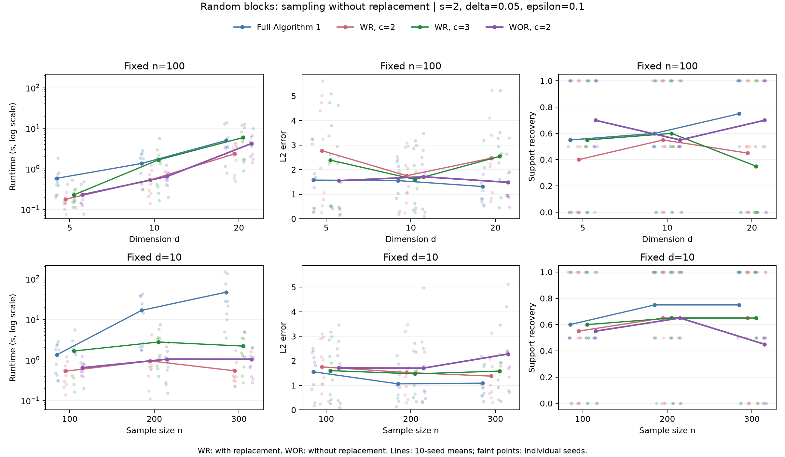

[Four-way paired results, selected indices, requested/actual block counts, diagnostics, and source hashes](../artifacts/sanity_check/random_block_selection_without_replacement/results.json). Historical comparisons: [WR coefficient 2](../artifacts/sanity_check/random_block_selection_scaling/results.json), [WR coefficient 3](../artifacts/sanity_check/random_block_selection_multiplier3/results.json).
<!-- random-block-sample-size:end -->
<!-- algorithm1-runtime-scaling:end -->

<!-- non-sparse-sdp:start -->
## Sanity check 21: Non-sparse estimators and specialized SDP

Parameters: $n=100$, $s=d=5$, $\delta=0.05$, $\epsilon=0.1$, $\nu=2.5$, adversarial strength 100, $C=2$, and $e_{\mathrm{tol}}=10^{-5}$. Seeds 0–9. Centered skew-t data use shape $0.5I+0.5\mathbf{1}\mathbf{1}^T$ and skew vector $10\mathbf{1}/\sqrt{5}$, as in the earlier 100-seed experiments. The true mean has amplitude Uniform(1,3) on all five coordinates. The repository attack replaces exactly ten rows; it is a heuristic, not a worst-case optimization. $\overline\lambda=2\lambda_{\max}(\Sigma)=739.098772$.

All methods use identical generated data within each seed, verified by SHA256. MoM/literature methods use balanced seeded blocks with $K=21$; random block selection uses $K_{\mathrm{sub}}=9$ without replacement. Random directions use $\widetilde J=1000$. Coordinate partition uses r=1, and Haar uses r=2,J=10. Hard thresholding is the identity at s=d.

Runs are sequential, with one BLAS/solver thread on Apple M4. Other experiment workers are stopped during timing and restarted afterwards from their checkpoints. Runtime includes estimator initialization, compilation, and optimization, excluding imports, data generation, and metric calculation. Failed/unconverged attempts do not contribute error or support means. Their attempted runtime is displayed explicitly.

| Method | Mean L2 error | Mean runtime (s) | Support recovery | Completed / attempted |
| --- | ---: | ---: | ---: | ---: |
| Sample mean + HT | 50.593692 | 0.000014 | 100.0% | 10/10 |
| Coordinate-wise MoM + HT | 8.319448 | 0.000159 | 100.0% | 10/10 |
| Geometric MoM + HT | 7.586904 | 0.000926 | 100.0% | 10/10 |
| Random MoM (J=1000) | 8.009688 | 0.029802 | 100.0% | 10/10 |
| Random trimmed (J=1000) | 3.267616 | 0.030517 | 100.0% | 10/10 |
| Brute-force net | 7.990313 | 0.173670 | 100.0% | 10/10 |
| Algorithm 1 | 8.034338 | 0.263604 | 100.0% | 10/10 |
| Dense Algorithm 1 | 8.034338 | 0.244765 | 100.0% | 10/10 |
| Random block selection (9/21) | 34.278732 | 0.092928 | 100.0% | 10/10 |
| Coordinate partition LS (r=1) | 8.319448 | 0.175155 | 100.0% | 10/10 |
| Coordinate partition max (r=1) | 8.319448 | 0.188296 | 100.0% | 10/10 |
| Haar LS (r=2, J=10) | 8.334481 | 0.537876 | 100.0% | 10/10 |
| Haar max (r=2, J=10) | 8.314803 | 0.538489 | 100.0% | 10/10 |
| DL / Clarabel | 7.919678 | 0.422121 | 100.0% | 10/10 |
| DL / specialized PTZ | — | 6.371935 (unsuccessful attempts) | — | 0/10 |
| CFB / Clarabel (T=100) | 4.767185 | 83.206756 | 80.0% | 10/10 |

Batch status: **finished**, 160/160 attempts saved. Each method is scheduled for ten seeds. Full support makes the support metric uninformative in this experiment.

**What the literature implementations measure.** DL uses covSDPofMeans with a covering SDP backend. Clarabel is an explicitly labeled general-solver control; PTZ implements the specialized positive-SDP multiplicative updates and factorized Taylor exponential. The SDP relative accuracy is eta=1e-4; PTZ has a diagnostic cap of 100,000 updates per decision call. Its d=5 identity sketch and dense d-by-d certificates do not implement the full high-dimensional nearly-linear kernel. CFB uses the SDP Algorithms 4/5, step size 1/20 and 100 iterations. Its completion means the requested iterations finished, not an outer accuracy certificate; 1e-5 is its distance-search precision.

**Theorem conditions.** Both literature methods use practical K=21. DL requires $K\ge300|O|=3000$; CFB prescribes $K=\lceil3200\log(1/\delta)\rceil=9587$, exceeding n. CFB's iid theorem does not establish guarantees for this adaptive attack. Observed errors therefore describe this practical configuration. [DL paper](https://arxiv.org/abs/1906.03058), [CFB paper](https://proceedings.mlr.press/v99/cherapanamjeri19b.html), [PTZ solver](https://arxiv.org/abs/1201.5135).

Excluded methods: Algorithm 2. See [scope record](../artifacts/sanity_check/non_sparse_sdp_comparison/method_selection.json).

An initial Algorithm 2 seed-0 attempt was interrupted after 226.1s to move that slow method to the end of the queue. It produced no estimate and is separate from the retained attempts in the table. [Interruption record](../artifacts/sanity_check/non_sparse_sdp_comparison/interrupted_initial_attempt.json).

PTZ diagnostics: alpha=1.545e-12; conservative decision-iteration bound 2.522e+19. Actual retained decision calls used 1,000,000 updates total; final covering relative gaps range 11.729039–20.000000. The bound is not an observed runtime or a lower bound on practical work: valid certificates may stop earlier.

DL/Clarabel and CFB/Clarabel mean runtimes are respectively 1.60× and 315.65× Algorithm 1 in this setup. These ratios compare the actual implementations and stopping rules, not asymptotic complexity.
The specialized PTZ backend did not produce a certified final estimate in any seed. Its capped attempts are not successful-estimation runtimes; they show that this direct implementation at the paper accuracy is not practical under this update budget. They do not refute the nearly-linear asymptotic theorem. A scaling claim would require multiple n,d settings and the complete large-d kernel.

CFB returns its zero initial iterate for seeds [3, 4], because it has the smallest estimated distance among that seed's 100 evaluated iterates. Consequently its literal nonzero-support recovery is 80.0%. This follows the paper's best-iterate return rule; it is not a sparse feature-selection result.

Contamination diagnostic: the full K=21 partition has 7–9 contaminated blocks. The nine-block subset contains a contaminated majority in 3/10 seeds. [Counts and paired errors](../artifacts/sanity_check/non_sparse_sdp_comparison/contamination_diagnostics.json) help interpret the random-block outliers; this is a diagnostic association, not a proof that contamination counts alone determine the error.

[Implementation details and deviations](../README_non_sparse.md). [Per-seed results and solver diagnostics](../artifacts/sanity_check/non_sparse_sdp_comparison/results.json). [Summary statistics and ranges](../artifacts/sanity_check/non_sparse_sdp_comparison/summary_statistics.json). [Data/source verification](../artifacts/sanity_check/non_sparse_sdp_comparison/validation.json). [Environment](../artifacts/sanity_check/non_sparse_sdp_comparison/environment.json). [Reproducible runner](../artifacts/sanity_check/non_sparse_sdp_comparison/run.py).

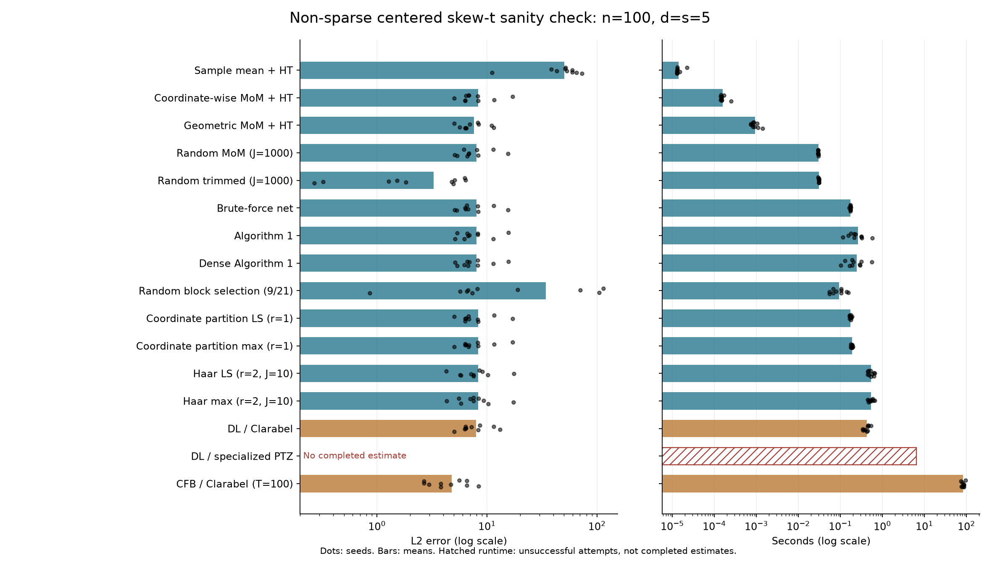
<!-- non-sparse-sdp:end -->

<!-- non-sparse-sdp-d10-eps001:start -->
## Sanity check 22: Non-sparse d=s=10, epsilon=0.01

Repeat of sanity check 21 with **d=s=10** and **epsilon=0.01**. Algorithm 2 is excluded throughout. Other parameters stay n=100, delta=0.05, nu=2.5, adversarial strength=100, C=2, e_tol=1e-5, and seeds 0–9. Centered skew-t uses shape 0.5*I+0.5*11' and skew vector 10*1/sqrt(d); the seed-specific true amplitude is Uniform(1,3) on every coordinate. The attack replaces exactly one row per seed. The covariance input is 2*lambda_max(Sigma)=764.098772. The data are shared exactly within a seed/method comparison; samples are not nested across the two dimensions.

The corrected full-support complexity d is used: Algorithm 1 and ordinary MoM methods use K=21; dense Algorithm 1 uses K=21 (complexity d); coordinate partitions r=1 use K=7; Haar r=2,J=10 uses K=11 (delta/J), with original-data box K=21. DL and CFB explicitly use K=21. Random block selection requests 29 blocks but uses all 21 after min(K,K_sub), without replacement. Random directions use tilde_J=1000. Random trimmed uses raw data, trimming k=5 observations per tail. Hard thresholding is the identity at full support.

At s=d, both Algorithm 1 implementations already optimize over all coordinates. Following the user correction, the common block rule uses complexity d at full support (s*log(d/s) remains the default for s<d). Both implementations now use the same K=21 and partition; the dense wrapper bypasses outer support selection. Random block selection also uses complexity d in K_sub. Earlier records affected by the zero-complexity full-support rule are preserved under archive/pre_full_support_rule_correction and excluded from this table. Unaffected raw-data methods, coordinate projections, the dense solver, and K=21 literature fits are retained with their original source manifest recorded.

Timing: sequential fresh worker processes, one BLAS/solver thread, with the pre-existing experiment 8 stopped during measurement and resumed afterwards. Runtime includes estimator setup/compilation, excluding imports/data generation/metrics. Error and support means use completed runs only. CFB completion means its 100 requested iterations finished, not an outer error certificate; e_tol controls its distance search.

| Method | K | Mean L2 error | Mean runtime (s) | Support recovery | Completed / recorded |
| --- | ---: | ---: | ---: | ---: | ---: |
| Sample mean + HT | raw data | 6.172139 | 0.000017 | 100.0% | 10/10 |
| Coordinate-wise MoM + HT | 21 | 2.521752 | 0.000143 | 100.0% | 10/10 |
| Geometric MoM + HT | 21 | 2.469955 | 0.000817 | 100.0% | 10/10 |
| Random MoM (J=1000) | 21 | 2.482493 | 0.042626 | 100.0% | 10/10 |
| Random trimmed (J=1000) | raw data | 2.490797 | 0.067380 | 100.0% | 10/10 |
| Brute-force net | 21 | — | skipped (net-size guard) | — | 0/10 |
| Algorithm 1 (s=d) | 21 | 2.503241 | 1.903828 | 100.0% | 10/10 |
| Algorithm 1 (dense solver) | 21 | 2.503240 | 1.801179 | 100.0% | 10/10 |
| Random block selection (21/21) | 21 | 2.503241 | 1.898107 | 100.0% | 10/10 |
| Coordinate partition LS (r=1) | 7 | 1.804392 | 0.109615 | 100.0% | 10/10 |
| Coordinate partition max (r=1) | 7 | 1.804392 | 0.148873 | 100.0% | 10/10 |
| Haar LS (r=2, J=10) | 11 | 1.782243 | 0.330491 | 100.0% | 10/10 |
| Haar max (r=2, J=10) | 11 | 1.804887 | 0.342062 | 100.0% | 10/10 |
| DL / Clarabel | 21 | 2.469701 | 1.084942 | 100.0% | 10/10 |
| DL / specialized PTZ | 21 | — | 7.383063 (unsuccessful attempts) | — | 0/10 |
| CFB / Clarabel (T=100) | 21 | 6.009667 | 162.522342 | 66.7% | 6/6 |

Batch status: **cancelled_by_user**, 156/160 scheduled records resolved. Algorithm 2 has no scheduled fits.

Brute-force: the default radius-1/4 net contains 2,437,667,157 points, above the unchanged 200,000-point guard (the float64 direction array alone would require 181.6 GiB). All such records are resource-guard skips, not successful fits or estimation runtimes.

Algorithm 1 versus random block selection: all original blocks are selected; maximum coordinate difference in the 10 completed paired seeds is 0. Any runtime difference measures selection/bookkeeping and run variability.

Specialized PTZ: eta=1e-4, at most 100,000 updates per decision call; paper step alpha=1.545e-12. 0/10 retained attempts produced a completed estimate. This is the same small-d factorized-Taylor/identity-sketch implementation with dense d-by-d certificates as sanity check 21; the full high-dimensional nearly-linear kernel is not implemented. Unfinished calls are not successful-estimation runtimes.

CFB returns its zero initial iterate in seeds [1, 2], following the paper's minimum-estimated-distance return rule. Full-support recovery here is a literal nonzero-coordinate metric, not sparse feature selection.

The literature methods still use practical block counts: DL's sufficient condition K>=300*|O|=300 exceeds n=100, while CFB prescribes ceil(3200*log(1/delta))=9587 and its iid theorem does not cover this adaptive contamination. Results describe this implementation/configuration, not those guarantees. [DL](https://arxiv.org/abs/1906.03058), [CFB](https://proceedings.mlr.press/v99/cherapanamjeri19b.html), [PTZ](https://arxiv.org/abs/1201.5135).

Both d and epsilon change relative to sanity check 21, and several block counts change too. Cross-setting runtime ratios cannot isolate a dimension effect or establish nearly-linear scaling.

[Per-seed results](../artifacts/sanity_check/non_sparse_sdp_d10_eps001/recorded_results.json). [Summary statistics](../artifacts/sanity_check/non_sparse_sdp_d10_eps001/summary_statistics.json). [Validation](../artifacts/sanity_check/non_sparse_sdp_d10_eps001/validation.json). [Settings](../artifacts/sanity_check/non_sparse_sdp_d10_eps001/config.json). [Frozen source hashes](../artifacts/sanity_check/non_sparse_sdp_d10_eps001/source_hashes.json). [Runner](../artifacts/sanity_check/non_sparse_sdp_d10_eps001/run.py). [Implementation details](../README_non_sparse.md).

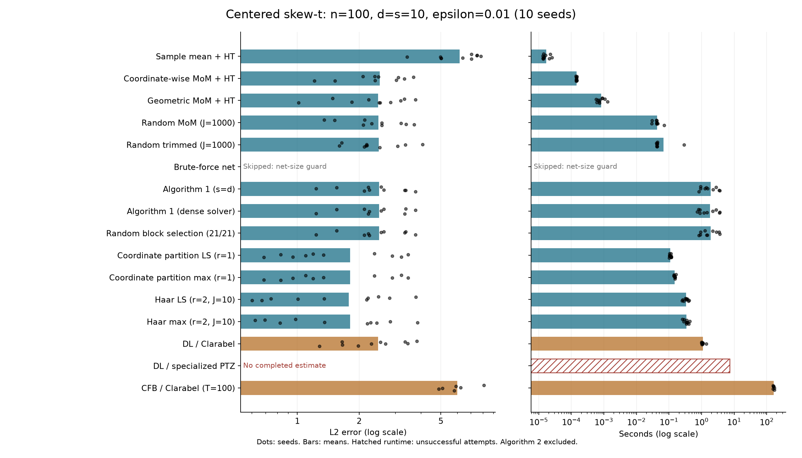
<!-- non-sparse-sdp-d10-eps001:end -->
